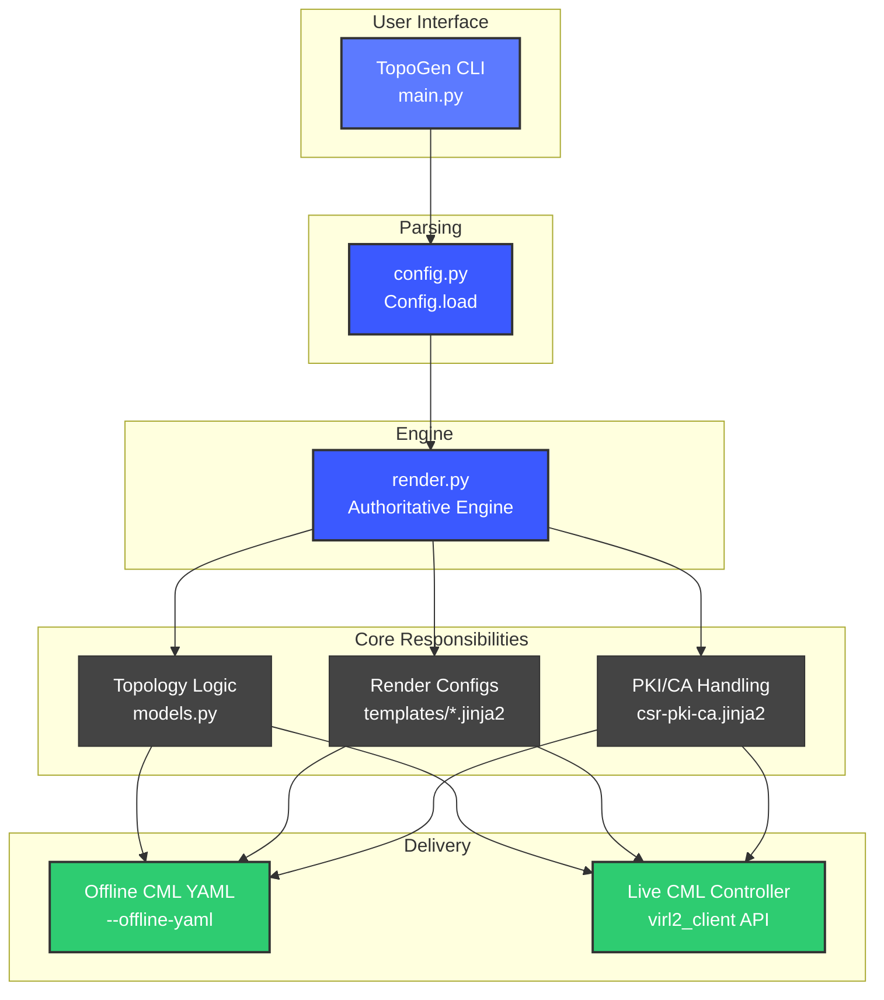

<!--
File Chain (see DEVELOPER.md - this file!):
Doc Version: v1.7.4
Date Modified: 2026-02-19

- Called by: Developers (new contributors, AI assistants), maintainers
- Reads from: Codebase analysis, architecture decisions, team conventions
- Writes to: None (documentation only, but guides all development)
- Calls into: References README.md, TESTED.md, CONTRIBUTING.md, TODO.md, code files

Purpose: Developer-oriented guide to TopoGen codebase, file chains, validation, and workflows.
         Primary reference for understanding code structure, dependencies, and development process.

Blast Radius: None (documentation only, but critical for developer onboarding and AI navigation)
-->

# Developer notes


This file is a developer-oriented starting point for TopoGen.


## Quick start (skim)


- If you are new here, read:

  - `README.md` (user-facing behavior and examples)

  - `DEVELOPER.md` (this file)

- Core flow (where to look first):

  - CLI flags: `src/topogen/main.py`

  - Topology + rendering behavior: `src/topogen/render.py`

  - Device configs: `src/topogen/templates/*.jinja2`

- Validate changes:

  - Prefer offline first: generate `--offline-yaml out\<lab>.yaml` and search output with PowerShell `Select-String`.

  - Then (if needed) boot in CML and run basic show commands (see "How to validate changes").

## Architecture at a glance

High-level execution flow showing the authoritative engine and delivery paths.



## Tested platforms

For detailed version information (Python, CML servers, node images, dependencies), see [TESTED.md](TESTED.md).

**TL;DR**: Python 3.12.0, CML 2.6.1/2.7.0, CSR1000v 17.3, IOSv 15.9, Windows 11.

## 5-minute environment validation


Before making any changes, verify your environment is working:


### 1. Check package version matches repo


```powershell

topogen -v

```


Expected: version should match `pyproject.toml` or show "Unreleased" if installed editable with `-e .`


If the version is stale, reinstall editable:


```powershell

python -m pip install -e .

```


### 2. Generate a small offline lab


```powershell

topogen -T iosv-eigrp --device-template iosv -m flat --offline-yaml out\env-test.yaml --overwrite 4

```


Expected output includes:

- Progress through "creating" nodes and links

- "Offline YAML written to out\env-test.yaml"


### 3. Validate the generated YAML


```powershell

Select-String -Path out\env-test.yaml -Pattern "node_definition: iosv"

```


Expected: 4+ matches (1 per router + DNS host)


```powershell

Select-String -Path out\env-test.yaml -Pattern "router eigrp 100"

```


Expected: 4 matches (1 per router config)


### 4. Verify templates are loadable


```powershell

topogen --list-templates

```


Expected: list of available templates including `iosv`, `iosv-eigrp`, `csr-eigrp`, `iosv-dmvpn`, etc.


### What this proves


- Python environment is working

- TopoGen package is installed and current

- Templates are accessible

- Offline YAML generation works

- Output directory (`out\`) is writable


If any step fails, troubleshoot before proceeding:

- Virtual environment activated?

- Package installed editable (`pip install -e .`)?

- Working directory is repo root?

## What TopoGen is


TopoGen is a Python CLI tool that generates CML labs:


- **Online**: creates labs/nodes/links on a CML controller via the PCL (`virl2-client`).

- **Offline**: writes a CML YAML lab file locally with `--offline-yaml`.


It also renders per-node startup-configs using **Jinja2 templates**.


Terminology:


- `-T` / `--template`: which config template to render (`src/topogen/templates/*.jinja2`)

- `--device-template`: which CML node definition to use (e.g., `iosv`, `csr1000v`)


Pitfall:


- In general, keep the config template (`-T`) aligned with the device template (`--device-template`). For example, using an IOSv config template on a CSR1000v node definition can result in wrong interface names or unsupported config at boot.


## Authoritative sources of truth


- `src/topogen/render.py`: topology semantics + rendering behavior (authoritative engine)

- `src/topogen/templates/*.jinja2`: emitted device configuration (what nodes boot with)

- `README.md`: user-facing CLI contract and examples

- **DMVPN node count:** In DMVPN mode (default, no `--dmvpn-hubs`), `nodes` is the number of **spokes**; R1 is the hub. So **total router count = nodes + 1** (e.g. `nodes=5` → R1 hub + R2–R6 spokes = 6 routers). See README for `--dmvpn-hubs` and flat-pair semantics.

- `CHANGES.md`: what changed between released versions

- `TODO.md`: in-progress ideas/roadmap (not guaranteed implemented)


Maintenance note:

- Some offline YAML generation features (notably `--mgmt-bridge` external_connector emission and related OOB switch/link wiring) currently appear as repeated blocks across multiple offline renderers in `src/topogen/render.py`. This is intentional for now, but it increases maintenance cost (a future edit could fix one mode and miss another). Prefer refactoring into a shared helper when touching this area again.


## Runtime dependencies (from `pyproject.toml`)


Required:


- `jinja2` (template rendering)

- `virl2-client` (CML controller API client for online mode)

- `pyserde[toml]` (read/write `config.toml`)

- `networkx` (topology logic in some modes)

- `enlighten` (progress bars)


Optional:


- `gooey` (GUI entrypoint)


## Repository layout (what matters)


Required to run:


- `pyproject.toml`

- `src/topogen/`

  - `__init__.py` (package entrypoint exposure)

  - `main.py` (CLI parsing, dispatch)

  - `render.py` (authoritative topology + rendering engine)

  - `config.py` (config model + load/save)

  - `models.py` (dataclasses + `TopogenError`)

  - `templates/` (all `*.jinja2` templates)


Nice to have:


- `README.md` (user docs)

- `CHANGES.md` (release notes)

- `TODO.md` (roadmap)

- `.github/workflows/` (CI)

- `.images/` (demo assets)

- `CONTRIBUTING.md` (contributor workflow)


## Entry points


Defined in `pyproject.toml`:


- `topogen = topogen:main`

- `topogen-gui = topogen.gui:main`


These resolve through `src/topogen/__init__.py` and then into the real logic:


- CLI: `src/topogen/main.py:main()` (also runnable as `python -m topogen` via `src/topogen/__main__.py`)

- GUI: `src/topogen/gui.py:main()` (wraps the same CLI parsing and then calls `topogen.main.main()`)


## High-level dependency chain (call graph)


When you run `topogen ...`:


1. `src/topogen/main.py`

   - Parses args (argparse)

   - Loads config via `src/topogen/config.py` (`Config.load()`)

   - Selects the topology mode and template

   - Calls into `src/topogen/render.py` (`Renderer`) for online or offline generation


2. `src/topogen/render.py`

   - Builds nodes/links + addressing

   - Loads templates from `src/topogen/templates/` (package resources)

   - Renders per-node configs using Jinja2

   - Either:

     - writes offline YAML, or

     - uses `virl2_client.ClientLibrary` to create/update the lab on a controller


3. `src/topogen/templates/*.jinja2`

   - Produce IOS/IOS-XE configs based on the passed Jinja context (`config`, `node`, and feature flags)


## AI onboarding prompt (copy/paste)


Paste this into a fresh AI session to get it oriented quickly:


```text

You are working in the TopoGen repo (Python 3.12+). Start by reading DEVELOPER.md.


Goal: implement a small feature or bugfix without breaking existing modes.


Key flow:

- CLI entrypoint: src/topogen/main.py

- Authoritative topology + rendering: src/topogen/render.py

- Device configs: src/topogen/templates/*.jinja2


When adding a feature:

1) add/modify CLI flags in main.py

2) pass the flag into render.py logic and into the Jinja context

3) implement emitted config lines in the relevant template(s)

4) update README.md + CHANGES.md

5) validate with an offline YAML lab and (if applicable) an online controller run


Use the "File pointers" section in DEVELOPER.md to understand what each file reads/writes/calls.

```


## AI guardrails (default boundaries)

**When to act (mandatory):**

- Do not do anything unless the user has **expressly and explicitly** told you to do it. Ask the user for approval before running commands or editing files.
- **Questions or statements are not instructions.** If the user asks a question (e.g. "why is X?") or makes a statement (e.g. "X should be Y"), only answer or explain. Do not treat that as a request to change code, run a command, or edit files — unless the user has explicitly updated their instructions (e.g. "then change it" or "add that to the doc").
- **Make no assumptions.** If something is confusing or unclear, do not assume; ask the user questions.
- End every response with exactly one of: **Done** | **Stopped** | **Blocked** | **I am confused** | **What options do you want me to do: 1, 2, or 3?** | **Task completed**.

Unless a task explicitly requires otherwise:


- Prefer editing:

  - `src/topogen/main.py` (CLI flags + wiring)

  - `src/topogen/render.py` (behavior + Jinja context)

  - `src/topogen/templates/*.jinja2` (emitted device config)

  - Docs: `README.md`, `CHANGES.md`, `DEVELOPER.md`


- Avoid editing (high blast radius) unless asked:

  - `pyproject.toml` (dependencies, entrypoints, packaging metadata)

  - `src/topogen/__init__.py` (entrypoint exposure)

  - `.github/workflows/*` (CI behavior)

  - `.gitignore` (what artifacts get committed)


- Never commit generated artifacts:

  - `out\` (gitignored offline YAML outputs)


- **Verify every change:** After making any code or config change, **grep** (or `Select-String`) the modified file(s) and/or generated output to confirm the change is present before reporting done. Do not consider a task complete until verification is done.


## Common tasks -> file chain (LLM-friendly)


- **Add a new CLI flag**

  - `src/topogen/main.py` (argparse)

  - `src/topogen/render.py` (consume the flag + pass into Jinja context)

  - `src/topogen/templates/*.jinja2` (emit config)

  - Docs: `README.md`, `CHANGES.md`


- **Change how addressing/topology is computed**

  - `src/topogen/render.py`

  - `src/topogen/models.py` (only if new per-node/per-link fields are needed)

  - Docs: `README.md` (if user-visible)


- **Change device config text (without changing topology logic)**

  - `src/topogen/templates/*.jinja2`

  - `src/topogen/render.py` (only if you need to add context variables)


- **Change online (controller) behavior**

  - `src/topogen/render.py` (calls `virl2_client`)

  - Docs: `README.md` (env vars / flags)


- **Change config.toml defaults/parsing**

  - `src/topogen/config.py`

  - `src/topogen/main.py` (wire flags like `--config`, `--write`)


## Worked example: `--eigrp-stub` flag


Reference implementation:


- Commit: `bfe0498` (feat(dmvpn): add --eigrp-stub for flat-pair evens)


Goal:


- Add a CLI flag `--eigrp-stub` that enables `eigrp stub connected summary` in the generated router configs (scoped by topology rules).


Typical change pattern (what got edited):


- `src/topogen/main.py`

  - Add the CLI flag and plumb it into the rendering call.

- `src/topogen/render.py`

  - Decide which nodes should be treated as “stub” based on the selected mode/underlay.

  - Pass the stub decision into the Jinja rendering context.

- `src/topogen/templates/*.jinja2`

  - Emit `eigrp stub connected summary` when the context indicates stub should be enabled.

- Docs

  - Update `README.md` and `CHANGES.md` to reflect the new flag and its semantics.


Validation pattern:


- Generate an offline YAML lab and search for the emitted config line:


```powershell

topogen --cml-version 0.3.0 -m dmvpn --dmvpn-underlay flat-pair -T iosv-dmvpn --device-template iosv --eigrp-stub --offline-yaml out\test.yaml --overwrite 20

Select-String -Path out\test.yaml -Pattern "eigrp stub connected summary"

```


## File pointers (called-by / reads-from / writes-to / calls-into)


The intent of this section is to reduce guesswork.


If this file and the code disagree, treat the code as authoritative and update `DEVELOPER.md` in the same PR.


- For an **AI**, these pointers help answer: "Where do I edit, and what else must I touch?"

- For a **human**, these pointers help answer: "What are the side effects and blast radius of a change?"


### Understanding the File Chain Terms


Each file in this codebase includes file chain documentation (in code comments or docstrings) using four key terms. This makes every file self-documenting for both humans and AI assistants. Here's what each term means:


- **Called by**: Which files, functions, or systems invoke this code

  - Answers: "Who triggers this?"

  - Example: `src/topogen/render.py` is called by `src/topogen/main.py`

  - Impact: If you change this file's interface (function signature, exports), you must update all callers


- **Reads from**: What input data this code consumes

  - Answers: "What does this depend on?"

  - Examples: Config files, environment variables, Jinja context variables, API responses

  - Impact: If you change what this file expects, you must ensure those inputs are provided correctly


- **Writes to**: What output or side effects this code produces

  - Answers: "What does this change or create?"

  - Examples: Files written to disk, API calls that modify remote state, stdout/logging

  - Impact: If you change what this file outputs, you must ensure downstream consumers can handle it


- **Calls into**: What downstream dependencies this code triggers

  - Answers: "What does this invoke?"

  - Examples: Other Python modules, Jinja templates, external libraries, API clients

  - Impact: If you change what this file calls, you must ensure those dependencies exist and work correctly


**Why this matters**:

- **Blast radius**: Quickly understand what breaks if you modify a file

- **Dependencies**: Trace the full chain from CLI input to final output

- **Self-documentation**: Read any single file and immediately understand its role

- **AI-friendly**: Enables assistants to navigate the codebase without guessing


### EEM applets (examples/) – interactive CLI pattern and CR

When writing EEM applets that drive **interactive** IOS-XE CLI prompts (e.g. `crypto pki authenticate` with `[yes/no]:`), two issues can cause the response to never be accepted:

1. **Pattern matching too early**  
   Using `pattern ".*"` on the command that produces the prompt can match before the router has printed the prompt. The next command (e.g. `yes`) is then sent too early and is lost or misinterpreted.  
   **Fix:** Use a pattern that matches the actual prompt text, e.g. `pattern "yes/no"` so EEM waits until the prompt is visible before sending the next command.

2. **Missing carriage return after the response**  
   On some IOS-XE versions, the EEM CLI driver does not send a newline/carriage return after the command string. The router receives the characters (e.g. `yes`) but not Enter, so the line is never submitted.  
   **Fix:** Add an extra action after the response that sends a line (e.g. `cli command " "`) so a CR is sent and the response is submitted.

See `examples/eem-client-pki-authenticate.txt` and `examples/eem-test-pki-authenticate.txt` for the working pattern (`pattern "yes/no"` plus `cli command " "` after `yes`). Use `debug event manager action cli` on the device to confirm IN/OUT timing if troubleshooting.

### EEM placement in IOS-XE configs

`event manager applet` blocks **must appear after** `line vty` / `line con` sections in the generated configuration. IOS-XE parses the config top-down and `end` inside an EEM conditional (`action X.Y end`) can collide with the global config parser if it appears before `line` stanzas. Place all EEM applets as the **last configuration section** before the final `end` statement.

Correct ordering:

```
line vty 0 4
 ...
line con 0
 ...
!
event manager applet TOPOGEN-NOSHUT authorization bypass
 event timer cron cron-entry "@reboot"
 action 1.0 cli command "enable"
 ...
!
end
```

### EEM action label numbering

EEM sorts action labels **lexicographically**, not numerically. Labels like `1.10` sort before `1.2` because the string `"1.10"` < `"1.2"`. Keep the minor number (after the dot) within `0`–`9` to avoid misordering. Use additional major groups (`2.0`, `3.0`, `4.0`, ...) instead of extending a single group past `.9`.


### AI Onboarding: Doc Version & Commit Rules (Mandatory)

> **This section is normative. All AI-generated and human-generated changes MUST follow these rules.**

#### Definition: versioned file

A **versioned file** is any file that contains a line matching:

```
Doc Version: vMAJOR.MINOR.PATCH
```

in the base branch **or** in the proposed change.

#### Mandatory invariants

1. **If a versioned file changes, its Doc Version MUST change in the same commit/PR.**
2. **Doc Version MUST NOT decrease.**
3. **Exactly one `Doc Version:` line is allowed per file.**
4. **The `Doc Version:` line MUST NOT be removed.**
5. **Valid format is required:**

   ```
   Doc Version: v<major>.<minor>.<patch>
   ```

   (no suffixes, prefixes, or extra text)

If any invariant is violated, the change is invalid.

#### Choosing the bump

- **PATCH** — wording changes, clarifications, formatting, examples, small fixes
- **MINOR** — new sections, new rules, workflow-affecting clarifications
- **MAJOR** — rule changes that invalidate prior assumptions

**If unsure, bump PATCH.**

#### Commit message requirements (mandatory)

If a commit or PR changes one or more versioned files, the **commit message MUST include the Doc Version change(s)**.

**Required format (one line per file):**

```
<file>: vOLD → vNEW
```

**Examples:**

```
docs(developer): tighten doc version enforcement
DEVELOPER.md: v1.4.2 → v1.5.0
```

```
docs(readme): clarify install steps
README.md: v1.3.4 → v1.3.5
```

If multiple versioned files are changed, list **each file on its own line**.

**Prohibited:**

- Changing a versioned file without mentioning its version bump in the commit message
- Mentioning a version bump that does not appear in the diff
- Rolling back a Doc Version in either the file or the commit message

#### Same-diff requirement (explicit)

The Doc Version bump **must appear in the same diff** as the content change.
Follow-up commits or separate PRs to "fix the version" are not allowed.

#### Required self-checks (AI and human)

Before finalizing a change that touches a versioned file:

1. **Verify the diff shows the version change**

   ```bash
   git diff HEAD -- <file> | grep 'Doc Version:'
   ```

   The output **must show both**:

   - the old `Doc Version:` line (removed), and
   - the new `Doc Version:` line (added).

2. **Verify the commit message includes the version delta**

   ```
   <file>: vOLD → vNEW
   ```

If either check fails, the change is invalid.

#### Enforcement

These rules are **enforced by CI** (or will be). Any PR that violates them will fail and must be corrected before merge.

> **Intent does not override enforcement.**
> A change that fails CI is considered incomplete, regardless of author (human or AI).

#### Copy-paste rule summary (for automation)

```
- Versioned file changed ⇒ Doc Version must change in same diff
- Never decrease or remove Doc Version
- Exactly one Doc Version line per file
- Commit message must include: <file>: vOLD → vNEW
- If unsure, bump PATCH
```

---

### Document Versioning — format and examples

See **AI Onboarding** above for invariants and enforcement. Below: format and file-style reference.

**Format**: `Doc Version: v{major}.{minor}.{patch}` (semantic versioning). **Date Modified**: On the line immediately below `Doc Version:`, include `Date Modified: YYYY-MM-DD` (ISO date when the file was last substantively changed).

**File examples** (comment syntax by type):

Markdown:
```markdown
<!--
File Chain (see DEVELOPER.md):
Doc Version: v1.0.0
Date Modified: YYYY-MM-DD

- Called by: ...
-->
```

Python/TOML:
```python
# File Chain (see DEVELOPER.md):
# Doc Version: v1.0.0
# Date Modified: YYYY-MM-DD
#
# - Called by: ...
```

Jinja2:
```jinja2
{# File Chain (see DEVELOPER.md):
# Doc Version: v1.0.0
# Date Modified: YYYY-MM-DD
#
# - Called by: ...
#}
```

**Conventional-commit bump triggers** (reference): PATCH — `fix:`, `docs:`, `chore:`; MINOR — `feat:`; MAJOR — `BREAKING CHANGE:` or `!` after type.


### `src/topogen/__init__.py`


- **Called by**

  - Console scripts via `pyproject.toml` entrypoints (`topogen = topogen:main`)

- **Reads from**

  - Package metadata via `importlib.metadata.metadata("topogen")`

- **Writes to**

  - None

- **Calls into**

  - `src/topogen/main.py` (exports `main`)

  - `src/topogen/render.py` (exports `Renderer`)

  - `src/topogen/config.py` (exports `Config`)


### `src/topogen/main.py`

- **Doc Version:** v1.1.4

- **Called by**

  - `src/topogen/__init__.py` (entrypoint export)

  - `src/topogen/gui.py` (GUI wrapper)

  - `src/topogen/__main__.py` (when running `python -m topogen`)

- **Reads from**

  - `config.toml` (or `--config`) via `Config.load()`

  - Environment variables (direct): `LOG_LEVEL`

- **Writes to**

  - stdout/stderr (logging)

  - Delegates offline YAML / online controller changes to `render.py`

- **Calls into**

  - `src/topogen/config.py` (`Config`)

  - `src/topogen/render.py` (`Renderer`, `get_templates()`)

  - `src/topogen/models.py` (`TopogenError`)


### `src/topogen/render.py`

- **Doc Version:** v1.0.12

- **Called by**

  - `src/topogen/main.py`

- **Reads from**

  - Packaged templates in `src/topogen/templates/` (via `topogen.templates` package resources)

  - `Config` values (IP pools, credentials, domain)

  - Online controller auth: `VIRL2_URL`, `VIRL2_USER`, `VIRL2_PASS` from `os.environ`, passed explicitly to `ClientLibrary()`

- **Writes to**

  - Offline YAML file (`--offline-yaml`)

  - Online CML controller state (labs/nodes/links/configs) via `virl2_client.ClientLibrary`

- **Calls into**

  - `jinja2` (render templates)

  - `virl2_client` (online API)

  - `src/topogen/dnshost.py` (`dnshostconfig()`)

  - `src/topogen/lxcfrr.py` (`lxcfrr_bootconfig()`)

  - `src/topogen/models.py` (TopogenNode/Interface models)


### `src/topogen/__main__.py`

- **Doc Version:** v1.0.0

- **Called by**

  - Python interpreter when running `python -m topogen`

- **Reads from**

  - None (entry point only)

- **Writes to**

  - None (calls `main()` and exits with its return code)

- **Calls into**

  - `src/topogen/main.py` (`main()`)


### `src/topogen/templates/*.jinja2`


- **Called by**

  - `src/topogen/render.py` (Jinja render step)

- **Reads from**

  - Jinja context (commonly `config`, `node`, plus feature flags)

- **Writes to**

  - Startup-config text embedded into offline YAML, or pushed to the controller (online)

- **Calls into**

  - None (template-only)


### `src/topogen/config.py`


- **Called by**

  - `src/topogen/main.py` (loads config)

  - `src/topogen/render.py` (uses config values)

  - `src/topogen/dnshost.py` (uses config values)

- **Reads from**

  - `config.toml` (or `--config` path)

- **Writes to**

  - `config.toml` when `--write` / `Config.save()` is used

- **Calls into**

  - `serde.toml` (`from_toml`, `to_toml`)


### `src/topogen/models.py`


- **Called by**

  - `src/topogen/main.py` (`TopogenError`)

  - `src/topogen/render.py` (TopogenNode/Interface/CoordsGenerator)

  - `src/topogen/dnshost.py` (DNShost/TopogenNode)

- **Reads from**

  - None

- **Writes to**

  - None

- **Calls into**

  - None (pure dataclasses/types)


### `src/topogen/dnshost.py`


- **Called by**

  - `src/topogen/render.py`

- **Reads from**

  - Jinja context data (`Config`, `TopogenNode`, list of `DNShost` entries)

- **Writes to**

  - Returns a boot script string (DNS host config)

- **Calls into**

  - `jinja2` (renders the inline template)


### `src/topogen/gui.py`


- **Called by**

  - Console script `topogen-gui` (`pyproject.toml`)

- **Reads from**

  - CLI args via `sys.argv` (Gooey populates argv)

  - Optional dependency: `gooey`

- **Writes to**

  - stdout/stderr (errors when Gooey is not installed)

- **Calls into**

  - `src/topogen/main.py` (`create_argparser()`, `main()`)


## Offline vs online


- **Offline** (`--offline-yaml out\lab.yaml`):

  - No controller needed.

  - Produces a YAML you import into CML.

  - `out\` is gitignored by default; in some environments tools/assistants may not be able to read generated artifacts, so validate via terminal search (e.g., PowerShell `Select-String`) rather than asking a tool to open the file.


- **Online** (no `--offline-yaml`):

  - Requires controller env vars (typical):

    - `VIRL2_URL`

    - `VIRL2_USER`

    - `VIRL2_PASS`

  - Uses `--insecure` if your controller TLS cert is not trusted.


### Progress bars (`--progress`)


- Progress bars are **opt-in** (they only show when `--progress` is provided).

- Progress bars are supported for both:

  - Offline YAML generation (local CPU work)

  - Online controller lab creation (CML API calls + node/link creation)

- Offline generation can complete very quickly even for large node counts (it does not boot routers).


## Gooey (GUI) notes


TopoGen has an optional GUI wrapper that reuses the CLI.


- Install:

  - `pip install -e ".[gui]"`

- Run:

  - `topogen-gui`


How it works:


- `src/topogen/gui.py` imports Gooey late (so normal CLI usage does not require Gooey).

- Gooey uses the same argparse definition by calling `topogen.main.create_argparser(parser_class=GooeyParser)`.

- The GUI then calls the normal CLI `topogen.main.main()`.


Common gotchas:


- If you installed TopoGen non-editable, reinstall after local changes:

  - `python -m pip install .`

- If you installed editable, code changes are picked up automatically:

  - `python -m pip install -e .`

  - or for GUI: `python -m pip install -e ".[gui]"`

- If online mode fails with no output, rerun with `-l DEBUG`.


## Where to implement features


Rule of thumb:


- **New CLI flag**: `src/topogen/main.py` (argparse)

- **Topology behavior / when to apply config**: `src/topogen/render.py`

- **Config lines emitted**: `src/topogen/templates/*.jinja2`

- **New per-node data fields**: `src/topogen/models.py`

- **Config.toml default / parsing**: `src/topogen/config.py`


## How to validate changes


**Mandatory:** After any change, grep (or `Select-String`) to verify the change is present in the expected file(s) or generated YAML before considering the task complete.


Offline (recommended first pass):


- Generate an offline YAML under `out\` (gitignored).

- Validate by searching the generated YAML/config text (PowerShell examples):

  - `Select-String -Path out\*.yaml -Pattern "eigrp stub connected summary"`

  - `Select-String -Path out\*.yaml -Pattern "router eigrp"`

  - `Select-String -Path out\*.yaml -Pattern "tunnel mode gre multipoint"`


Online (basic smoke checks once routers boot):


- Routing:

  - `show ip route`

  - `show ip eigrp neighbors` (if using EIGRP)

- DMVPN (if applicable):

  - `show dmvpn`

  - `show ip nhrp`

- Config presence:

  - `show run | include eigrp stub`


## Git workflow for this repo


- Branch naming:

  - `feat/<short-name>` for features

  - `fix/<short-name>` for bugfixes

  - `docs/<short-name>` for documentation-only changes

- Workflow:

  - Keep changes incremental (one feature per branch/PR).

  - Prefer squash-merge to keep history clean.

  - After merge: sync `main` locally and delete the feature branch.

- **After push: validate CI.** Open the repository’s **Actions** tab on GitHub (or the commit/PR page) and confirm the workflow run for your push **succeeded** (all jobs green). If it failed, view or download the run log from that run to diagnose.

- Interaction preference:

  - AIs/assistants can propose exact commands; you run them and share output.


## Feature closeout checklist


See the README checklist and follow it for any change that affects behavior. When updating **CHANGES.md** (Unreleased), list each modified file and its new Doc Version (rev) so reviewers can see what was touched and to what rev. Example: `Files: src/topogen/render.py (rev v1.0.0), README.md (rev v1.2.1)`.


- [Feature closeout checklist](README.md#feature-closeout-checklist-required)

