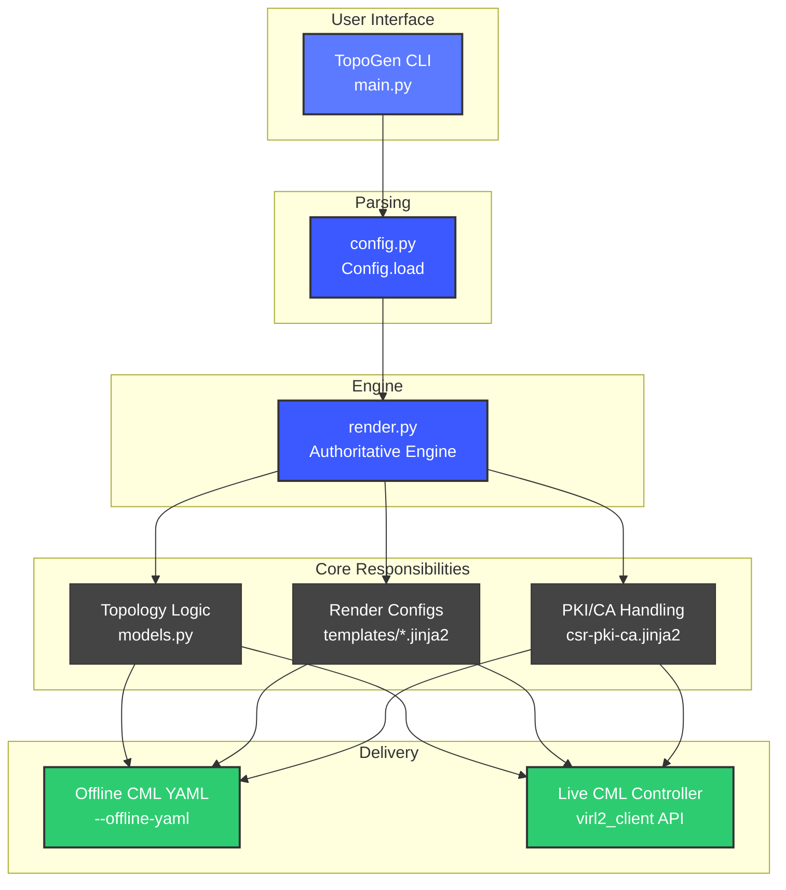

<!--
File Chain (see DEVELOPER.md - this file!):
Doc Version: v1.9.4
Date Modified: 2026-06-13

- Called by: Developers (new contributors, AI assistants), maintainers
- Reads from: Codebase analysis, architecture decisions, team conventions
- Writes to: None (documentation only, but guides all development)
- Calls into: References README.md, TESTED.md, CONTRIBUTING.md, TODO.md, code files

Purpose: Developer-oriented guide to TopoGen codebase, file chains, validation, and workflows.
         Primary reference for understanding code structure, dependencies, and development process.

Blast Radius: None (documentation only, but critical for developer onboarding and AI navigation)
-->

# Developer notes


This file is a developer-oriented starting point for TopoGen.


## Quick start (skim)


- If you are new here, read:

  - `README.md` (user-facing behavior and examples)

  - `DEVELOPER.md` (this file)

- Core flow (where to look first):

  - CLI flags: `src/topogen/main.py`

  - Topology + rendering behavior: `src/topogen/render.py`

  - Device configs: `src/topogen/templates/*.jinja2`

- Validate changes:

  - Prefer offline first: generate `--offline-yaml out\<lab>.yaml` and search output with PowerShell `Select-String`.

  - Then (if needed) boot in CML and run basic show commands (see "How to validate changes").

## Architecture at a glance

High-level execution flow showing the authoritative engine and delivery paths.


```mermaid
graph TD
    classDef input fill:#5c7aff,stroke:#333,color:#fff,stroke-width:2px;
    classDef engine fill:#3b59ff,stroke:#333,color:#fff,stroke-width:2px;
    classDef logic fill:#444,stroke:#333,color:#fff,stroke-width:1px;
    classDef output fill:#2ecc71,stroke:#333,color:#fff,stroke-width:2px;

    subgraph Entry ["User Interface"]
        CLI[TopoGen CLI<br/>main.py]
    end

    subgraph Config ["Parsing"]
        MAIN[config.py<br/>Config.load]
    end

    subgraph Core ["Engine"]
        RENDER[render.py<br/>Authoritative Engine]
    end

    subgraph Tasks ["Core Responsibilities"]
        TOP[Topology Logic<br/>models.py]
        TMP[Render Configs<br/>templates/*.jinja2]
        PKI[PKI/CA Handling<br/>csr-pki-ca.jinja2]
    end

    subgraph Destination ["Delivery"]
        YAML[Offline CML YAML<br/>--offline-yaml]
        LIVE[Live CML Controller<br/>virl2_client API]
    end

    CLI --> MAIN
    MAIN --> RENDER
    RENDER --> TOP
    RENDER --> TMP
    RENDER --> PKI
    TOP --> YAML
    TOP --> LIVE
    TMP --> YAML
    TMP --> LIVE
    PKI --> YAML
    PKI --> LIVE

    class CLI input;
    class MAIN engine;
    class RENDER engine;
    class TOP,TMP,PKI logic;
    class YAML,LIVE output;
```

## Tested platforms

For detailed version information (Python, CML servers, node images, dependencies), see [TESTED.md](TESTED.md).

**TL;DR**: Python 3.12.0, CML 2.6.1/2.7.0, CSR1000v 17.3, IOSv 15.9, Windows 11.

## CML lab schema versions (confirmed)

The `--cml-version` flag controls the `version:` field in offline YAML **and** which optional fields are emitted. Known mapping from CML release to lab schema version:

- CML 2.5 = schema `0.2.0` (max). Accepted: `0.0.1`–`0.2.0`. Fields: `annotations`, `notes`. No `smart_annotations`.
- CML 2.6.1 = schema `0.2.1`. Fields: `annotations`, `notes`. No `smart_annotations`.
- CML 2.7 = schema `0.2.2` (max). Accepted: `0.0.1`–`0.2.2`. Fields: `annotations`, `notes`. No `smart_annotations`.
- CML 2.8.1 = schema `0.3.0`. Accepted: `0.0.1`–`0.3.0`. Introduced `smart_annotations`, `parameters` (node), `mac_address` (interface). Fields: `annotations`, `notes`, `smart_annotations`.
- CML 2.9 = schema `0.3.0`. Accepted: `0.0.1`–`0.3.0`. Fields: `annotations`, `notes`, `smart_annotations`.
- CML 2.10 = schema `0.3.1`. Accepted: `0.0.1`–`0.3.1`. Lab-level: `lab.node_staging` block (`enabled`, `start_remaining`, `abort_on_failure`). Per-node: `priority` (integer, higher boots first; `null` = unassigned), `pyats` block (`username`, `password`, `enable_password` — all nullable), `parameters: {}` (consistently present), `configuration` changed from plain string to list of `{name, content}` objects (CML 2.10 still accepts plain-string on import). Per-link: `conditioning: {}` (link conditioning, empty by default). Per-interface: `mac_address: null` and `slot: N` now consistently present. Note: **Autostart** (Enable Autostart, Priority, Delay Next Lab Start) is a server-side setting only — not exported in YAML, out of scope for offline generation. Fields: `annotations`, `notes`, `smart_annotations`, `node_staging`. **TG-165:** `--pki` auto-enables staging via `resolve_staging_flags()` in `main.py` unless `--no-staging` is set; requires `--cml-version >= 0.3.1` or staging is omitted with a warning.

TopoGen omits `smart_annotations` when `--cml-version` is `<= 0.2.2`. See `_intent_annotation_lines()` in `src/topogen/render.py`. **TG-167:** intent metadata (description, hidden notes, scaled down-only annotation) is applied offline via `_finalize_offline_yaml_with_intent()` and online via `Renderer._apply_online_lab_intent()` after topology build. Optional `--intent-spot` adds an `unmanaged_switch` marker node (default off).

## 5-minute environment validation


Before making any changes, verify your environment is working:


### 1. Check package version matches repo


```powershell

topogen -v

```


Expected: version should match `pyproject.toml` (`[project].version`, currently read by `topogen.__version__`). Do not hardcode the package version elsewhere in docs — update examples when releasing.

**Not the same as `--cml-version`:** the CLI flag sets the CML lab YAML schema (e.g. `0.3.1` for CML 2.10), not the TopoGen package version.


If the version is stale, reinstall editable:


```powershell

python -m pip install -e .

```


### 2. Generate a small offline lab


```powershell

topogen -T iosv-eigrp --device-template iosv -m flat --offline-yaml out\env-test.yaml --overwrite 4

```


Expected output includes:

- Progress through "creating" nodes and links

- "Offline YAML written to out\env-test.yaml"


### 3. Validate the generated YAML


```powershell

Select-String -Path out\env-test.yaml -Pattern "node_definition: iosv"

```


Expected: 4+ matches (1 per router + DNS host)


```powershell

Select-String -Path out\env-test.yaml -Pattern "router eigrp 100"

```


Expected: 4 matches (1 per router config)


### 4. Verify templates are loadable


```powershell

topogen --list-templates

```


Expected: list of available templates including `iosv`, `iosv-eigrp`, `csr-eigrp`, `iosv-dmvpn`, etc.


### What this proves


- Python environment is working

- TopoGen package is installed and current

- Templates are accessible

- Offline YAML generation works

- Output directory (`out\`) is writable


If any step fails, troubleshoot before proceeding:

- Virtual environment activated?

- Package installed editable (`pip install -e .`)?

- Working directory is repo root?

## What TopoGen is


TopoGen is a Python CLI tool that generates CML labs:


- **Online**: creates labs/nodes/links on a CML controller via the PCL (`virl2-client`).

- **Offline**: writes a CML YAML lab file locally with `--offline-yaml`.


It also renders per-node startup-configs using **Jinja2 templates**.


Terminology:


- `-T` / `--template`: which config template to render (`src/topogen/templates/*.jinja2`)

- `--device-template`: which CML node definition to use (e.g., `iosv`, `csr1000v`)


Pitfall:


- In general, keep the config template (`-T`) aligned with the device template (`--device-template`). For example, using an IOSv config template on a CSR1000v node definition can result in wrong interface names or unsupported config at boot.


## Authoritative sources of truth


- `src/topogen/render.py`: topology semantics + rendering behavior (authoritative engine)

- `src/topogen/templates/*.jinja2`: emitted device configuration (what nodes boot with)

- `README.md`: user-facing CLI contract and examples

- **DMVPN node count:** In DMVPN mode (default, no `--dmvpn-hubs`), `nodes` is the number of **spokes**; R1 is the hub. So **total router count = nodes + 1** (e.g. `nodes=5` → R1 hub + R2–R6 spokes = 6 routers). See README for `--dmvpn-hubs` and flat-pair semantics.

- `CHANGES.md`: what changed between released versions

- `TODO.md`: optional maintainer notes (not guaranteed implemented); internal backlog is tracked in Jira (TG project on roberthosford.atlassian.net)


Maintenance note:

- Some offline YAML generation features (notably `--mgmt-bridge` external_connector emission and related OOB switch/link wiring) currently appear as repeated blocks across multiple offline renderers in `src/topogen/render.py`. This is intentional for now, but it increases maintenance cost (a future edit could fix one mode and miss another). Prefer refactoring into a shared helper when touching this area again.

- **CA-ROOT config is built in two ways.** The online render path uses `csr-pki-ca.jinja2` (via Jinja render). The offline paths (`offline_dmvpn_yaml` flat and flat-pair, `offline_flat_yaml`, `offline_flat_pair_yaml`) build CA config **inline in `render.py`** by assembling `ca_config_lines` from a base template render, then splicing in PKI blocks (`_pki_ca_self_enroll_block_lines`, `_pki_ca_authenticate_eem_lines`, aliases, etc.) before `end`. Any change to CA-ROOT config (e.g. adding an alias, EEM applet, or reordering blocks) must be applied in **both** `csr-pki-ca.jinja2` and all four inline assembly sites in `render.py`.


## NaC developer reference (critical)

Use this section as the implementation baseline for all `--nac` work.

**Universal offline scope:** `--nac` is supported on every offline renderer listed
below. CLI guardrails no longer restrict specific mode/node-count pairs; users
compose the same offline flags as without `--nac` and add `--nac` when they want
the sibling `nac/` tree.

CLI guardrails (`src/topogen/main.py`):

- `validate_nac_mvp_guardrails()` — historical name; enforces offline-only path,
  IOS-XE `--device-template` (`iosv`, `csr1000v`), and rejects import/online
  YAML workflows; rejects `--nac` combined with `--blank` (use `--bootstrap`
  instead)
- `validate_bootstrap_guardrails()` — `--bootstrap` requires `--nac` and
  `--mgmt`; rejects `--blank`, `--pki`, and `--getvpn`
- `validate_nodes_for_mode()` — allows `nodes=1` when `--nac` is set; non-NaC
  paths still require `nodes>=2`

Render-time guardrails (`src/topogen/render.py`):

- `validate_nac_supported_iosxe_nodes()` / `_validate_nac_router_nodes_if_enabled()`
  — abort before any `nac/` artifact exists if the router set cannot be projected
- `describe_nac_unsupported_nodes()` — error text for CLI and render paths

Path/layout contract:

- Resolver: `src/topogen/render.py::resolve_offline_artifact_paths()` (and
  `resolve_offline_output_paths()` where still used)
- Input: `--offline-yaml out/<lab>.yaml --nac`
- Output:
  - `out/<lab>/<lab>.yaml` (offline CML YAML)
  - `out/<lab>/nac/nac.yaml` (lean `iosxe.devices[].configuration.*` model)
  - Terraform scaffold: `out/<lab>/nac/{main.tf,versions.tf,terraform.tfvars.example,.gitignore}`
  - Ansible stub: `out/<lab>/nac/{ansible.cfg,inventory.yaml,group_vars/all.yaml,host_vars/*.yaml,verify_reachability.yaml}`
  - Informational (NOT Terraform inputs): `out/<lab>/nac/{devices.yaml,nac_metadata.yaml}`
  - Note: `terraform.tfvars.json` is intentionally NOT emitted (Terraform auto-loads that name; it cannot be labeled "not an input"). Credentials come from env vars; the provider uses `insecure = true` (lab-only).

Canonical writer and adapters:

- `src/topogen/nac.py`
  - `build_canonical_nac_model(...)` (fat model used by scaffold writers)
  - `project_nac_yaml(...)` (lean projection actually written to `nac.yaml`)
  - `write_nac_yaml(...)`
  - `write_terraform_scaffold(...)` (main.tf/versions.tf/tfvars.example/.gitignore)
  - `write_nac_tree(...)` (top-level coordinator: NaC + Terraform + Ansible)
- `src/topogen/render.py::_write_nac_tree_if_enabled()` — shared hook used by all offline NaC paths
- Offline renderers that emit NaC trees:
  - `offline_simple_yaml(...)`
  - `offline_nx_yaml(...)`
  - `offline_flat_yaml(...)`
  - `offline_flat_pair_yaml(...)`
  - `offline_dmvpn_yaml(...)` (flat underlay)
  - `offline_dmvpn_flat_pair_yaml(...)`

Tests (run when touching NaC):

| File | Purpose |
|------|---------|
| `tests/test_nac_cli_guardrails.py` | CLI parsing, offline/import rejection, IOS-XE template checks, `nodes=1` with `--nac`, `--bootstrap` guardrails, composed flags (mgmt/VRF/CSR) |
| `tests/test_nac_output_paths.py` | `out/<lab>/` layout, no nested `nac/` on rerun |
| `tests/test_nac_writer.py` | `nac.py` scaffold content, `yaml_files = ["nac.yaml"]`, DMVPN naming |
| `tests/test_nac_day0_restconf.py` | RESTCONF/NETCONF lines in day0 when `--nac` |
| `tests/test_nac_render_e2e.py` | End-to-end offline runs: flat, flat-pair, DMVPN flat/flat-pair, nx `--bootstrap` thin day-0; non-NaC paths skip `nac/` |
| `tests/test_nac_golden_smoke.py` | Regenerates committed golden fixtures under `tests/fixtures/nac/golden-flat-*` |
| `tests/test_nac_terraform_plan.py` | TG-161/TG-162: opt-in `terraform init` + `terraform plan` contract against pinned `netascode/nac-iosxe` (9-case matrix; DMVPN cases assert tunnel/crypto resources) |

### NaC Terraform plan contract gate (TG-161)

Golden fixtures and `terraform validate` do not evaluate module locals from `nac.yaml`.
Only `terraform plan` catches schema mismatches (e.g. TG-159 DMVPN tunnel `id` vs `name`).

**When to run:** after changing `nac.py`, NaC projection in `render.py`, or pinned module/provider pins.

**Requirements:** Terraform `>= 1.8.0` on `PATH`, network for `terraform init` (registry downloads).

**Opt-in locally** (default `pytest` skips these tests):

```powershell
# Windows — use a short temp root to avoid MAX_PATH issues during terraform init
New-Item -ItemType Directory -Force C:\t | Out-Null
$env:TOPOGEN_TERRAFORM_PLAN = "1"
$env:TF_PLUGIN_CACHE_DIR = "C:\t\topogen-tf-plugin-cache"
$env:IOSXE_USERNAME = "lab"
$env:IOSXE_PASSWORD = "lab"
$env:IOSXE_URL = "https://127.0.0.1"
uv run pytest tests/test_nac_terraform_plan.py -m terraform -v
```

```bash
# Linux/macOS
export TOPOGEN_TERRAFORM_PLAN=1
export TF_PLUGIN_CACHE_DIR="${TMPDIR:-/tmp}/topogen-tf-plugin-cache"
export IOSXE_USERNAME=lab IOSXE_PASSWORD=lab IOSXE_URL=https://127.0.0.1
uv run pytest tests/test_nac_terraform_plan.py -m terraform -v
```

**Matrix (9 cases):** flat, flat-pair, DMVPN flat, DMVPN flat-pair, DMVPN flat IKEv2-PSK (IOSv), flat/flat-pair CSR1000v, DMVPN flat/flat-pair CSR1000v.

**DMVPN plan assertions (TG-162):** DMVPN matrix entries require `iosxe_interface_tunnel.tunnel` and `tunnel_source` in plan output; IKEv2-PSK case additionally requires crypto IPsec/IKEv2 proposal/profile resources and `tunnel_protection_ipsec_profile`.

**Offline validation (TG-162):** `.\scripts\validate-tg162-dmvpn-live.ps1` (offline gates; pass `-LiveApply` for CML + NaC apply + CLI checks).

### NaC thin day-0 bootstrap (`--bootstrap`)

Use `--nac --bootstrap` when Terraform must own routing/protocol config and CML
should boot only a **thin reachability skin** (not full Jinja day-0, not empty
`--blank`).

| Path | CLI | CML router `configuration` | Full intent |
|------|-----|---------------------------|-------------|
| Normal NaC | `--nac` | Full Jinja render + RESTCONF splice | `nac.yaml` |
| NaC proof / live apply | `--nac --bootstrap` | Thin day-0 only | `nac.yaml` (OSPF, interfaces, CDP, etc.) |
| Empty topology | `--blank` | `configuration: ""` | N/A (incompatible with `--nac`) |

Thin day-0 includes: hostname, credentials, RSA, `Mgmt-vrf` + OOB Gi DHCP (with
`--mgmt-bridge`), `ip ssh version 2`, `ip ssh server algorithm authentication
password`, RESTCONF/NETCONF, SSH vty. It does **not** include OSPF/EIGRP, tenant
interfaces, CDP, or PKI — those stay in `nac.yaml` for `terraform apply`.

Implementation: `src/topogen/render.py` — `_render_bootstrap_config()`,
`_finalize_router_day0_config()` (replaces per-path `_inject_nac_restconf_day0`
calls). Provenance: `--bootstrap` is appended via `_append_common_offline_args_bits()`
into lab `description`, hidden `notes`, and annotation `text_content`.

**Import path:** at scale, use `cml2/` Terraform (see [Choosing CML import path](#choosing-cml-import-path-cml2-vs-topogen--up)); reserve `topogen --up` for small quick imports.

**Live E2E (CSR1000v, mgmt-bridge):** generate with `--nac --bootstrap
--terraform-cml2 --mgmt --mgmt-bridge`; `terraform apply` in `cml2/`; sync mgmt
addresses from the emitted `nac/sync-nac-mgmt.py` (or `topogen sync-nac-mgmt`;
same implementation in `src/topogen/nac_mgmt_sync.py`). Sync uses **pyATS on the
CML controller** (2.10+) when available; falls back to CML L3 snooping. See
`nac/NAC-WORKFLOW.md` in every `--nac` tree and [CML 2.10 and mgmt sync](#cml-210-pyats-and-mgmt-sync-operator-caveats).
Live-validated 2026-06-09: `TG186-BOOTSTRAP-E2E` (2× CSR1000v nx), 11 NaC
resources, OSPF neighbor FULL on Gi1 (bootstrap replaces full Jinja in CML YAML).

**Mgmt sync modes:** `--mgmt-ipv6-mode slaac` sets default sync to IPv6 SLAAC;
otherwise DHCP (IPv4 mgmt-bridge). `nac_metadata.yaml` records `mgmt_mode`,
`mgmt_vrf`, `mgmt_interface`, and `mgmt_ipv6_mode`. Report: `nac/mgmt_sync.json`.
Legacy `scripts/sync-nac-mgmt-*.py` wrappers remain for repo-local use.

#### CML 2.10, pyATS, and mgmt sync (operator caveats)

TG-190 IPv6 OOB and the NaC bootstrap pipeline assume a **CML 2.10** controller for
mgmt address sync. Generate labs with `--cml-version 0.3.1` (schema for 2.10).

| Topic | What operators need to know |
|-------|------------------------------|
| **Where pyATS runs** | On the **CML server** (built into 2.10), not on the operator laptop. `sync-nac-mgmt.py` calls `node.run_pyats_command()` via the CML API (`virl2_client` + `VIRL2_*` env). No local pyATS install required. |
| **CML MCP** | Optional for Cursor/agent debugging (`send_cli_command`). **Not** used by CI, ProveCycle, or the emitted `nac/sync-nac-mgmt.py`. Non-AI operators use the Python sync script only. |
| **Node pyATS creds** | CLI on nodes must be reachable with credentials CML knows. Use `--set-pyats-creds` on sync (or set `pyats:` on nodes in CML 2.10 YAML / UI) — defaults match bootstrap day-0 (`cisco` / `cisco`). |
| **Fallbacks** | If pyATS is not ready: **CML L3 snooping** on the OOB interface (`--cml-snoop-only` skips pyATS). CI alias push may use **CML console SSH** when pyATS from the runner is unavailable. |
| **Timing** | `terraform apply -var=wait=true` waits for **BOOTED**, not for DHCP/SLAAC addresses. Re-run sync or use pipeline retries until `mgmt_sync.json` shows `synced` ≥ router count. |
| **Client vs server** | `virl2_client` on the operator host may be 2.9.x while the controller is 2.10.x; that is usually fine (compatibility warning only). |

**Recommended sync (IPv6 SLAAC / DHCPv6 on mgmt bridge):**

```bash
python out/<lab>/nac/sync-nac-mgmt.py \
  --lab-id "$LAB_ID" --nac-root out/<lab>/nac \
  --set-pyats-creds
```

Add `--cml-snoop-only` only when pyATS on the controller is known broken; snooping
may lag behind address assignment on large labs.

**CML < 2.10:** pyATS-on-controller and the `pyats:` node block are not available.
Use IPv4 mgmt-bridge sync (`--mode dhcp`) and expect limited IPv6 automation; not
the TG-190 CP2 target platform.

### CML CI/CD pipeline (TG-192)

End-to-end automation for Jira-triggered NaC bootstrap labs: generate → `cml2/` deploy →
emitted mgmt sync → `nac/` apply → verify → per-ticket customer CML user → READY Jira
comment. Teardown on ticket Done (opt-in / manual approval for destroy).

**Canonical flow (large labs — prefer `cml2/` over `topogen --up`):**

```
Jira trigger → topogen generate → terraform apply (cml2/) → wait BOOTED
  → python nac/sync-nac-mgmt.py → terraform apply (nac/) → verify gates
  → topogen provision-cml-user (lab_view+lab_exec) → Jira READY comment
On ticket Done → delete customer user → terraform destroy (cml2/)
```

#### Credential tiers

| Tier | Identity | Scope | Where stored |
|------|----------|-------|--------------|
| **Service account** | CI / operator admin | Full CML admin for deploy, sync, verify | `TF_VAR_*`, `VIRL2_*`, `IOSXE_*` in CI secrets / vault only |
| **Customer account** | `tg-<ticket>-<suffix>` | Single lab: `lab_view` + `lab_exec` only (`admin: false`) | Password via vault / 1Password — **never** in Jira comments |

#### Trigger

- Jira issue labeled `cml-lab` (or equivalent pipeline label); ticket key becomes the lab title suffix.
- Webhook: `scripts/jira-cml-webhook.py` → GitHub `repository_dispatch` (`cml-lab-provision` / `cml-lab-teardown`).
- CI: `.github/workflows/cml-nac-pipeline.yml` (`workflow_dispatch` or `repository_dispatch`).

#### Generate (reference: 300-node IPv6 SLAAC — TG-190-flat-300-nac-v6)

```bash
topogen --cml-version 0.3.1 -L "TG-190-flat-300-nac-v6" \
  300 --mode flat -T iosv --device-template iosv \
  --offline-yaml out/TG-190-flat-300-nac-v6.yaml \
  --nac --bootstrap --terraform-cml2 \
  --mgmt --mgmt-vrf Mgmt-vrf --mgmt-ipv6-mode slaac --mgmt-bridge \
  --mgmt-ipv6-cidr fd00:10:254::/64 \
  --overwrite
```

CI smoke (4 nodes): `.\scripts\validate-tg192-pipeline.ps1 -Regenerate` (see script for flags).

#### Deploy

```bash
terraform -chdir=out/<lab>/cml2 init
terraform -chdir=out/<lab>/cml2 apply -auto-approve -var=wait=true
LAB_ID=$(terraform -chdir=out/<lab>/cml2 output -raw lab_id)
```

#### Sync

Use the **emitted** helper (not `scripts/` as primary path):

```bash
python out/<lab>/nac/sync-nac-mgmt.py \
  --lab-id "$LAB_ID" --nac-root out/<lab>/nac \
  --set-pyats-creds
# IPv6-only / SLAAC labs may also pass --cml-snoop-only if controller pyATS fails
# IPv4 mgmt-bridge: --mode dhcp --fix-dhcp
```

Equivalent: `topogen sync-nac-mgmt` (same `src/topogen/nac_mgmt_sync.py`).

#### NaC apply

```bash
export IOSXE_USERNAME=... IOSXE_PASSWORD=...
terraform -chdir=out/<lab>/nac init
terraform -chdir=out/<lab>/nac apply -auto-approve
```

#### Verify (minimal gates)

- `mgmt_sync.json`: `synced` count matches router count.
- `terraform apply` exit code 0 (cml2 + nac).
- Optional: `ansible-playbook verify_reachability.yaml` or `ssh-fanout.py` for IPv6 SLAAC labs.

#### Handoff

```bash
topogen provision-cml-user \
  --lab-id "$LAB_ID" \
  --username "tg-TG-xxx-<suffix>" \
  --description "TG-xxx scoped user"
```

Or CML MCP `create_cml_user` with `admin: false`, permissions `lab_view` + `lab_exec`.

**READY Jira comment template** (password **not** in comment):

```
CML lab READY — TG-xxx
- Lab: <title> (<lab_uuid>)
- URL: <cml_base>/lab/<lab_uuid>
- Customer user: tg-TG-xxx-<suffix> (password: vault link / operator handoff)
- Sync: <N>/<N> routers in mgmt_sync.json
- NaC apply: success
```

Post via `scripts/jira-cml-webhook.py --event ready-comment ...` or Atlassian MCP `addCommentToJiraIssue`.

#### Teardown (on Jira Done — explicit operator approval recommended)

```bash
topogen provision-cml-user --username "tg-TG-xxx-<suffix>" --revoke
terraform -chdir=out/<lab>/cml2 destroy -auto-approve
```

Webhook: `repository_dispatch` type `cml-lab-teardown` (see `scripts/jira-cml-webhook.py`).

#### Environment variables

| Variable | Used by |
|----------|---------|
| `TF_VAR_address`, `TF_VAR_username`, `TF_VAR_password` (or `TF_VAR_token`), `TF_VAR_skip_verify` | `cml2/` Terraform provider |
| `VIRL2_URL`, `VIRL2_USER`, `VIRL2_PASS` | `sync-nac-mgmt.py`, `provision-cml-user` |
| `IOSXE_USERNAME`, `IOSXE_PASSWORD`, `IOSXE_URL` | NaC Terraform / device NETCONF |
| `CUSTOMER_CML_PASSWORD` | Optional fixed password for `provision-cml-user` (else CSPRNG) |
| `GITHUB_TOKEN`, `JIRA_*` | Webhook dispatch / Jira comments |

GitHub Actions secret names (values in vault only): `CML_TF_ADDRESS`, `CML_TF_USERNAME`,
`CML_TF_PASSWORD`, `CML_TF_SKIP_VERIFY`, `VIRL2_URL`, `VIRL2_USER`, `VIRL2_PASS`,
`IOSXE_USERNAME`, `IOSXE_PASSWORD`, `JIRA_WEBHOOK_SECRET`.

#### Scale note

Labs with **16+ routers** and `--mgmt` require `--mgmt-ipv6-mode slaac` (or dhcpv6); see
`docs/TG-190-checkpoint-1.md`.

**Offline validation:** `.\scripts\validate-tg192-pipeline.ps1` (pass `-LiveApply` for live CML).

**Success criteria per case:** TopoGen exit 0; `terraform init` exit 0; `terraform plan -input=false`
exit 0; stdout contains `Plan: N to add, 0 to change, 0 to destroy.`; no `Unsupported attribute`
or `Error:` lines; DMVPN cases satisfy their `plan_must_match` snippets. No `terraform apply`, no live devices.

### NaC DMVPN coverage matrix (TG-162)

Pinned module: `netascode/nac-iosxe/iosxe` 0.1.0. Day-0 reference: `csr-dmvpn.jinja2` / `iosv-dmvpn.jinja2`.

| Feature | Day-0 CML config | NaC / Terraform (`nac.yaml`) | Notes |
|---------|------------------|------------------------------|-------|
| NBMA underlay IPv4 | `interface GigabitEthernet*` | `interfaces.ethernets[]` | Modeled |
| Tunnel IPv4 | `interface Tunnel0` | `interfaces.tunnels[]` (`id`, `name`) | Modeled (TG-159) |
| `tunnel source` | `tunnel source GigabitEthernet*` | `tunnel_source` | Modeled (TG-162) |
| `no ip redirects` | `no ip redirects` | `ipv4.redirects: false` | Modeled (TG-162) |
| Front-side VRF (NBMA) | `vrf forwarding` / `tunnel vrf` | `vrf_forwarding`, `tunnel_vrf`, `vrfs[]` | Modeled when `--dmvpn-fvrf` |
| Overlay VRF (pair) | tunnel/loopback/pair `vrf forwarding` | `vrf_forwarding` on tunnel, loopback, pair ethernets | Modeled when `--vrf --pair-vrf` |
| IKEv2-PSK IPsec stack | `crypto ikev2` + `crypto ipsec` | `configuration.crypto.*` | Modeled when `--dmvpn-security ikev2-psk` |
| Tunnel IPsec protection | `tunnel protection ipsec profile` | `tunnel_protection_ipsec_profile` | Modeled with IKEv2-PSK/PKI/RSA flag (crypto body only for PSK today) |
| GRE mGRE mode | `tunnel mode gre multipoint` | — | **Out of scope** — not in nac-iosxe 0.1.0 tunnel schema |
| Tunnel key | `tunnel key` | — | **Out of scope** |
| NHRP (network-id, auth, map, NHS, redirect, shortcut) | `ip nhrp *` | — | **Out of scope** — no NHRP resources in nac-iosxe 0.1.0 |
| EIGRP over tunnel | `router eigrp` | — | **Out of scope** — module has OSPF processes only, not EIGRP |
| IKEv2-PKI / IKEv2-RSA + PKI trustpoints | day-0 PKI + IKEv2 rsa-sig | partial | Tunnel protection flag emitted; full PKI trustpoint modeling deferred (day-0 + `--pki` owns CA enrollment) |
| Phase 3 NHRP redirect/shortcut | hub/spoke NHRP extras | — | **Out of scope** (NHRP) |

Terraform still owns a **subset** of DMVPN: interface/crypto scaffolding that nac-iosxe exposes. NHRP, mGRE mode, tunnel key, and EIGRP remain day-0-only until a future nac-iosxe release adds those resources.

**Gap audit (2026-06-08):** Full 8-profile matrix, hub/spoke notes, terraform plan record, and Jira epic breakdown — `docs/nac/DMVPN-day0-nac-gap-audit.md`. Automation: `scripts/audit-dmvpn-day0-nac-gap.py`. Key **Emit** finding: IKEv2-PKI emits `tunnel_protection_ipsec_profile` without `configuration.crypto` (PSK path complete).

**CI:** GitHub Actions job `NaC Terraform plan contract` in `.github/workflows/python-package.yml`
runs when NaC-related paths change. Uses a warmed `TF_PLUGIN_CACHE_DIR`.

If you extend NaC scope:

1. Update CLI and render guardrails (`main.py`, `render.py`)
2. Ensure the renderer collects deterministic `nac_router_nodes`
3. Call `_write_nac_tree_if_enabled(...)` (or equivalent) in that offline path
4. Update docs (`README.md`, `CHANGES.md`, this file)
5. Add or adjust the tests in the table above

Tests (run when touching staging / PKI boot order):

| File | Purpose |
|------|---------|
| `tests/test_staging_pki.py` | TG-165: `--pki` auto-enables staging, `--no-staging` opt-out, CML version guardrail, offline YAML emits `node_staging` + CA-ROOT priority |

**Offline validation (TG-165):** `.\scripts\validate-tg165.ps1` (pytest + artifact checks).

## CML2 Terraform lifecycle scaffold reference (TG-150)

Use this section as the implementation baseline for `--terraform-cml2` lifecycle scaffold work.

Guardrail implementation:

- `src/topogen/main.py::validate_cml2_lifecycle_guardrails()`
- `--terraform-cml2` requires `--offline-yaml`
- `--cml2` is accepted as a short compatibility alias for `--terraform-cml2`
- Import workflow flags are rejected with `--terraform-cml2` because the scaffold is generated only alongside new offline YAML output

Path/layout contract:

- Resolver: `src/topogen/render.py::resolve_offline_artifact_paths()`
- Input: `--offline-yaml out/<lab>.yaml --terraform-cml2`
- Output:
  - `out/<lab>/<lab>.yaml` (offline CML YAML)
  - Terraform lifecycle scaffold: `out/<lab>/cml2/{main.tf,versions.tf,variables.tf,outputs.tf,.gitignore}`
  - The generated `variables.tf` defaults `topology_file` to `../<lab>.yaml` so no machine-local path is embedded
  - CML connection values are Terraform inputs only; no credentials, tokens, passwords, or controller URLs are written by TopoGen

Canonical writer:

- `src/topogen/cml2.py`
  - `write_cml2_lifecycle_scaffold(...)` (main.tf/versions.tf/variables.tf/outputs.tf/.gitignore)
  - Terraform provider: `CiscoDevNet/cml2`
  - Terraform resource: `cml2_lifecycle` with `topology = file(var.topology_file)`

User workflow (documented in README, not executed by TopoGen):

1. `topogen ... --offline-yaml out/<lab>.yaml --terraform-cml2 [--overwrite]`
2. `terraform -chdir=out/<lab>/cml2 init`
3. Set `TF_VAR_address`, `TF_VAR_username`, `TF_VAR_password` (or `TF_VAR_token`) — never commit these
4. `terraform -chdir=out/<lab>/cml2 plan` then `apply`
5. Optional: `--nac` in step 1 adds `out/<lab>/nac/` for device config after the lab is up
6. With `--nac --bootstrap`, CML YAML carries thin day-0 only; run DHCP sync then `terraform apply` in `nac/` (step 5 workflow)

Relationship to NaC:

- `--terraform-cml2` and `--nac` are independent. When both are enabled, `cml2/` and `nac/` are sibling directories under the generated lab root.
- Do not place CML lifecycle files under `nac/`; the `nac/` Terraform workspace targets device configuration through `netascode/nac-iosxe`.

### Choosing CML import path (`cml2/` vs `topogen --up`)

For **NaC bootstrap at scale**, prefer the generated `cml2/` workspace. Use
`topogen --up` only for quick one-off manual imports (small labs, local iteration).

| Path | Best for | CML state | Deploy |
|------|----------|-----------|--------|
| `cml2/` | Large labs (100+ nodes), CI/CD, repeatable IaC lifecycle; pairs with `nac/` | Terraform state under `out/<lab>/cml2/` | After `topogen ... --offline-yaml --terraform-cml2 [--nac --bootstrap]`: `terraform -chdir=out/<lab>/cml2 init` then `apply` (`plan` optional but recommended) |
| `topogen --up <yaml>` | Fast manual import, no Terraform footprint | None (direct CML API import) | `topogen --up out/<lab>/<lab>.yaml [-i]` — shorthand for `--import-yaml --import --start`; add `-i`/`--insecure` when the lab controller uses a self-signed cert |

**Terraform vs CLI:** `plan` is optional for both `cml2/` and `nac/` workspaces;
`init` + `apply` are required on Terraform paths. TopoGen does not run Terraform for
you.

**Guardrails:** `--terraform-cml2` rejects import flags (`--up`, `--import`,
`--import-yaml`) at generation time — generate the scaffold first, then
`terraform apply` in `cml2/`. Do not substitute `topogen --up` for `cml2/apply`
on large NaC bootstrap labs (e.g. TG-190 300-node flat); agents and operators
should follow the `cml2/` + `nac/` sibling workflow documented above.

Tests (run when touching CML2 lifecycle):

| File | Purpose |
|------|---------|
| `tests/test_cml2_lifecycle.py` | Scaffold files, secret-free content, CLI emits `cml2/` only, `--cml2` alias, `cml2/` + `nac/` siblings |
| `tests/test_nac_output_paths.py` | Shared offline path resolver behavior |
| `tests/test_nac_cli_guardrails.py` | CML2 guardrails alongside NaC |

If you extend CML2 lifecycle scope:

1. Update guardrails first (`main.py`)
2. Keep output under `out/<lab>/cml2/`
3. Keep connection settings as Terraform variables or environment-provided values
4. Update docs (`README.md`, `CHANGES.md`, this file)
5. Add or adjust the tests in the table above


## Runtime dependencies (from `pyproject.toml`)


Required:


- `jinja2` (template rendering)

- `virl2-client` (CML controller API client for online mode)

- `pyserde[toml]` (read/write `config.toml`)

- `networkx` (topology logic in some modes)

- `enlighten` (progress bars)


Optional:


- `gooey` (GUI entrypoint)


## Repository layout (what matters)


Required to run:


- `pyproject.toml`

- `src/topogen/`

  - `__init__.py` (package entrypoint exposure)

  - `main.py` (CLI parsing, dispatch)

  - `render.py` (authoritative topology + rendering engine)

  - `config.py` (config model + load/save)

  - `models.py` (dataclasses + `TopogenError`)

  - `templates/` (all `*.jinja2` templates)


Nice to have:


- `README.md` (user docs)

- `CHANGES.md` (release notes)

- `TODO.md` (optional maintainer notes; Jira TG backlog)

- `.github/workflows/` (CI)

- `.images/` (demo assets)

- `CONTRIBUTING.md` (contributor workflow)


## Entry points


Defined in `pyproject.toml`:


- `topogen = topogen:main`

- `topogen-gui = topogen.gui:main`


These resolve through `src/topogen/__init__.py` and then into the real logic:


- CLI: `src/topogen/main.py:main()` (also runnable as `python -m topogen` via `src/topogen/__main__.py`)

- GUI: `src/topogen/gui.py:main()` (wraps the same CLI parsing and then calls `topogen.main.main()`)


## High-level dependency chain (call graph)


When you run `topogen ...`:


1. `src/topogen/main.py`

   - Parses args (argparse)

   - Loads config via `src/topogen/config.py` (`Config.load()`)

   - Selects the topology mode and template

   - Calls into `src/topogen/render.py` (`Renderer`) for online or offline generation


2. `src/topogen/render.py`

   - Builds nodes/links + addressing

   - Loads templates from `src/topogen/templates/` (package resources)

   - Renders per-node configs using Jinja2

   - Either:

     - writes offline YAML, or

     - uses `virl2_client.ClientLibrary` to create/update the lab on a controller


3. `src/topogen/templates/*.jinja2`

   - Produce IOS/IOS-XE configs based on the passed Jinja context (`config`, `node`, and feature flags)


## AI onboarding prompt (copy/paste)


Paste this into a fresh AI session to get it oriented quickly:


```text

You are working in the TopoGen repo (Python 3.12+). Start by reading DEVELOPER.md.


Goal: implement a small feature or bugfix without breaking existing modes.


Key flow:

- CLI entrypoint: src/topogen/main.py

- Authoritative topology + rendering: src/topogen/render.py

- Device configs: src/topogen/templates/*.jinja2


When adding a feature:

1) add/modify CLI flags in main.py

2) pass the flag into render.py logic and into the Jinja context

3) implement emitted config lines in the relevant template(s)

4) update README.md + CHANGES.md

5) validate with an offline YAML lab and (if applicable) an online controller run


Use the "File pointers" section in DEVELOPER.md to understand what each file reads/writes/calls.

```


## AI guardrails (default boundaries)

**When to act (mandatory):**

- Do not do anything unless the user has **expressly and explicitly** told you to do it. Ask the user for approval before running commands or editing files.
- **Questions or statements are not instructions.** If the user asks a question (e.g. "why is X?") or makes a statement (e.g. "X should be Y"), only answer or explain. Do not treat that as a request to change code, run a command, or edit files — unless the user has explicitly updated their instructions (e.g. "then change it" or "add that to the doc").
- **Make no assumptions.** If something is confusing or unclear, do not assume; ask the user questions.
- End every response with exactly one of: **Done** | **Stopped** | **Blocked** | **I am confused** | **What options do you want me to do: 1, 2, or 3?** | **Task completed**.

Unless a task explicitly requires otherwise:


- Prefer editing:

  - `src/topogen/main.py` (CLI flags + wiring)

  - `src/topogen/render.py` (behavior + Jinja context)

  - `src/topogen/templates/*.jinja2` (emitted device config)

  - Docs: `README.md`, `CHANGES.md`, `DEVELOPER.md`


- Avoid editing (high blast radius) unless asked:

  - `pyproject.toml` (dependencies, entrypoints, packaging metadata)

  - `src/topogen/__init__.py` (entrypoint exposure)

  - `.github/workflows/*` (CI behavior)

  - `.gitignore` (what artifacts get committed)


- Never commit generated artifacts:

  - `out\` (gitignored offline YAML outputs)


- **Verify every change:** After making any code or config change, **grep** (or `Select-String`) the modified file(s) and/or generated output to confirm the change is present before reporting done. Do not consider a task complete until verification is done.

- **Shell syntax:** This repo is developed on Windows with PowerShell. **Bash heredoc (`<<'EOF'`) does not work in PowerShell.** Use PowerShell here-strings instead:

  ```powershell
  $msg = @"
  First line
  Second line
  "@
  git commit -m $msg
  ```

  Do not attempt bash heredoc syntax. It will fail every time.

## Common tasks -> file chain (LLM-friendly)


- **Add a new CLI flag**

  - `src/topogen/main.py` (argparse)

  - `src/topogen/render.py` (consume the flag + pass into Jinja context)

  - `src/topogen/templates/*.jinja2` (emit config)

  - Docs: `README.md`, `CHANGES.md`


- **Change how addressing/topology is computed**

  - `src/topogen/render.py`

  - `src/topogen/models.py` (only if new per-node/per-link fields are needed)

  - Docs: `README.md` (if user-visible)


- **Change device config text (without changing topology logic)**

  - `src/topogen/templates/*.jinja2`

  - `src/topogen/render.py` (only if you need to add context variables)


- **Change online (controller) behavior**

  - `src/topogen/render.py` (calls `virl2_client`)

  - Docs: `README.md` (env vars / flags)


- **Change config.toml defaults/parsing**

  - `src/topogen/config.py`

  - `src/topogen/main.py` (wire flags like `--config`, `--write`)


## Worked example: `--eigrp-stub` flag


Reference implementation:


- Commit: `bfe0498` (feat(dmvpn): add --eigrp-stub for flat-pair evens)


Goal:


- Add a CLI flag `--eigrp-stub` that enables `eigrp stub connected summary` in the generated router configs (scoped by topology rules).


Typical change pattern (what got edited):


- `src/topogen/main.py`

  - Add the CLI flag and plumb it into the rendering call.

- `src/topogen/render.py`

  - Decide which nodes should be treated as “stub” based on the selected mode/underlay.

  - Pass the stub decision into the Jinja rendering context.

- `src/topogen/templates/*.jinja2`

  - Emit `eigrp stub connected summary` when the context indicates stub should be enabled.

- Docs

  - Update `README.md` and `CHANGES.md` to reflect the new flag and its semantics.


Validation pattern:


- Generate an offline YAML lab and search for the emitted config line:


```powershell

topogen --cml-version 0.3.0 -m dmvpn --dmvpn-underlay flat-pair -T iosv-dmvpn --device-template iosv --eigrp-stub --offline-yaml out\test.yaml --overwrite 20

Select-String -Path out\test.yaml -Pattern "eigrp stub connected summary"

```


## File pointers (called-by / reads-from / writes-to / calls-into)


The intent of this section is to reduce guesswork.


If this file and the code disagree, treat the code as authoritative and update `DEVELOPER.md` in the same PR.


- For an **AI**, these pointers help answer: "Where do I edit, and what else must I touch?"

- For a **human**, these pointers help answer: "What are the side effects and blast radius of a change?"


### Understanding the File Chain Terms


Each file in this codebase includes file chain documentation (in code comments or docstrings) using four key terms. This makes every file self-documenting for both humans and AI assistants. Here's what each term means:


- **Called by**: Which files, functions, or systems invoke this code

  - Answers: "Who triggers this?"

  - Example: `src/topogen/render.py` is called by `src/topogen/main.py`

  - Impact: If you change this file's interface (function signature, exports), you must update all callers


- **Reads from**: What input data this code consumes

  - Answers: "What does this depend on?"

  - Examples: Config files, environment variables, Jinja context variables, API responses

  - Impact: If you change what this file expects, you must ensure those inputs are provided correctly


- **Writes to**: What output or side effects this code produces

  - Answers: "What does this change or create?"

  - Examples: Files written to disk, API calls that modify remote state, stdout/logging

  - Impact: If you change what this file outputs, you must ensure downstream consumers can handle it


- **Calls into**: What downstream dependencies this code triggers

  - Answers: "What does this invoke?"

  - Examples: Other Python modules, Jinja templates, external libraries, API clients

  - Impact: If you change what this file calls, you must ensure those dependencies exist and work correctly


**Why this matters**:

- **Blast radius**: Quickly understand what breaks if you modify a file

- **Dependencies**: Trace the full chain from CLI input to final output

- **Self-documentation**: Read any single file and immediately understand its role

- **AI-friendly**: Enables assistants to navigate the codebase without guessing


### EEM applets (examples/) – interactive CLI pattern and CR

When writing EEM applets that drive **interactive** IOS-XE CLI prompts (e.g. `crypto pki authenticate` with `[yes/no]:`), two issues can cause the response to never be accepted:

1. **Pattern matching too early**  
   Using `pattern ".*"` on the command that produces the prompt can match before the router has printed the prompt. The next command (e.g. `yes`) is then sent too early and is lost or misinterpreted.  
   **Fix:** Use a pattern that matches the actual prompt text, e.g. `pattern "yes/no"` so EEM waits until the prompt is visible before sending the next command.

2. **Missing carriage return after the response**  
   On some IOS-XE versions, the EEM CLI driver does not send a newline/carriage return after the command string. The router receives the characters (e.g. `yes`) but not Enter, so the line is never submitted.  
   **Fix:** Add an extra action after the response that sends a line (e.g. `cli command " "`) so a CR is sent and the response is submitted.

See `examples/eem-client-pki-authenticate.txt` and `examples/eem-test-pki-authenticate.txt` for the working pattern (`pattern "yes/no"` plus `cli command " "` after `yes`). Use `debug event manager action cli` on the device to confirm IN/OUT timing if troubleshooting.

### EEM placement in IOS-XE configs

`event manager applet` blocks **must appear after** `line vty` / `line con` sections in the generated configuration. IOS-XE parses the config top-down and `end` inside an EEM conditional (`action X.Y end`) can collide with the global config parser if it appears before `line` stanzas. Place all EEM applets as the **last configuration section** before the final `end` statement.

Correct ordering:

```
line vty 0 4
 ...
line con 0
 ...
!
event manager applet TOPOGEN-NOSHUT authorization bypass
 event timer cron cron-entry "@reboot"
 action 1.0 cli command "enable"
 ...
!
end
```

### EEM action label numbering

EEM sorts action labels **lexicographically**, not numerically. Labels like `1.10` sort before `1.2` because the string `"1.10"` < `"1.2"`. Keep the minor number (after the dot) within `0`–`9` to avoid misordering. Use additional major groups (`2.0`, `3.0`, `4.0`, ...) instead of extending a single group past `.9`.


### PKI CA clock backdate (notBefore grace window)

The CA-ROOT's `do clock set` is backdated by 1 day so the CA certificate's `notBefore` is always earlier than any client's clock. This prevents `%PKI-3-CERTIFICATE_INVALID_NOT_YET_VALID` errors on node boot.

Implementation in `render.py`:

- `_pki_clock_set_today(backdate_days=0)` — single function with an optional offset. `backdate_days > 0` shifts the date earlier.
- **CA-ROOT** call site (`_pki_ca_self_enroll_block_lines`): `_pki_clock_set_today(backdate_days=1)` → yesterday.
- **Client** call sites (`_inject_pki_client_trustpoint`, EEM applets): `_pki_clock_set_today()` → today (default).

For a future 3-level PKI hierarchy (`CA-ROOT → CA-POLICY → CA-ISSUING → clients`), use tiered offsets so every signer's `notBefore` is strictly older than anything it signs:

| PKI role | `backdate_days` | Example date (if today = Mar 13) |
|---|---|---|
| CA-ROOT (offline root) | `3` | Mar 10 |
| CA-POLICY (intermediate) | `2` | Mar 11 |
| CA-ISSUING (issuing) | `1` | Mar 12 |
| Clients (routers) | `0` | Mar 13 |

The function already accepts any integer, so adding new CA tiers only requires wiring the right value at each new call site.

### AI Onboarding: Doc Version & Commit Rules (Mandatory)

> **This section is normative. All AI-generated and human-generated changes MUST follow these rules.**

#### Definition: versioned file

A **versioned file** is any file that contains a line matching:

```
Doc Version: vMAJOR.MINOR.PATCH
```

in the base branch **or** in the proposed change.

#### Mandatory invariants

1. **If a versioned file changes, its Doc Version MUST change in the same commit/PR.**
2. **Doc Version MUST NOT decrease.**
3. **Exactly one `Doc Version:` line is allowed per file.**
4. **The `Doc Version:` line MUST NOT be removed.**
5. **Valid format is required:**

   ```
   Doc Version: v<major>.<minor>.<patch>
   ```

   (no suffixes, prefixes, or extra text)

If any invariant is violated, the change is invalid.

#### Choosing the bump

- **PATCH** — wording changes, clarifications, formatting, examples, small fixes
- **MINOR** — new sections, new rules, workflow-affecting clarifications
- **MAJOR** — rule changes that invalidate prior assumptions

**If unsure, bump PATCH.**

#### Commit message requirements (mandatory)

If a commit or PR changes one or more versioned files, the **commit message MUST include the Doc Version change(s)**.

**Required format (one line per file):**

```
<file>: vOLD → vNEW
```

**Examples:**

```
docs(developer): tighten doc version enforcement
DEVELOPER.md: v1.4.2 → v1.5.0
```

```
docs(readme): clarify install steps
README.md: v1.3.4 → v1.3.5
```

If multiple versioned files are changed, list **each file on its own line**.

**Prohibited:**

- Changing a versioned file without mentioning its version bump in the commit message
- Mentioning a version bump that does not appear in the diff
- Rolling back a Doc Version in either the file or the commit message

#### Same-diff requirement (explicit)

The Doc Version bump **must appear in the same diff** as the content change.
Follow-up commits or separate PRs to "fix the version" are not allowed.

#### Required self-checks (AI and human)

Before finalizing a change that touches a versioned file:

1. **Verify the diff shows the version change**

   ```bash
   git diff HEAD -- <file> | grep 'Doc Version:'
   ```

   The output **must show both**:

   - the old `Doc Version:` line (removed), and
   - the new `Doc Version:` line (added).

2. **Verify the commit message includes the version delta**

   ```
   <file>: vOLD → vNEW
   ```

If either check fails, the change is invalid.

#### Enforcement

These rules are **enforced by CI** (or will be). Any PR that violates them will fail and must be corrected before merge.

> **Intent does not override enforcement.**
> A change that fails CI is considered incomplete, regardless of author (human or AI).

#### Copy-paste rule summary (for automation)

```
- Versioned file changed ⇒ Doc Version must change in same diff
- Never decrease or remove Doc Version
- Exactly one Doc Version line per file
- Commit message must include: <file>: vOLD → vNEW
- If unsure, bump PATCH
```

---

### Document Versioning — format and examples

See **AI Onboarding** above for invariants and enforcement. Below: format and file-style reference.

**Format**: `Doc Version: v{major}.{minor}.{patch}` (semantic versioning). **Date Modified**: On the line immediately below `Doc Version:`, include `Date Modified: YYYY-MM-DD` (ISO date when the file was last substantively changed).

**File examples** (comment syntax by type):

Markdown:
```markdown
<!--
File Chain (see DEVELOPER.md):
Doc Version: v1.0.0
Date Modified: YYYY-MM-DD

- Called by: ...
-->
```

Python/TOML:
```python
# File Chain (see DEVELOPER.md):
# Doc Version: v1.0.0
# Date Modified: YYYY-MM-DD
#
# - Called by: ...
```

Jinja2:
```jinja2
{# File Chain (see DEVELOPER.md):
# Doc Version: v1.0.0
# Date Modified: YYYY-MM-DD
#
# - Called by: ...
#}
```

**Conventional-commit bump triggers** (reference): PATCH — `fix:`, `docs:`, `chore:`; MINOR — `feat:`; MAJOR — `BREAKING CHANGE:` or `!` after type.


### `src/topogen/__init__.py`


- **Called by**

  - Console scripts via `pyproject.toml` entrypoints (`topogen = topogen:main`)

- **Reads from**

  - Package metadata via `importlib.metadata.metadata("topogen")`

- **Writes to**

  - None

- **Calls into**

  - `src/topogen/main.py` (exports `main`)

  - `src/topogen/render.py` (exports `Renderer`)

  - `src/topogen/config.py` (exports `Config`)


### `src/topogen/main.py`

- **Doc Version:** v1.9.2

- **Called by**

  - `src/topogen/__init__.py` (entrypoint export)

  - `src/topogen/gui.py` (GUI wrapper)

  - `src/topogen/__main__.py` (when running `python -m topogen`)

- **Reads from**

  - `config.toml` (or `--config`) via `Config.load()`

  - Environment variables (direct): `LOG_LEVEL`

- **Writes to**

  - stdout/stderr (logging)

  - Delegates offline YAML / online controller changes to `render.py`

- **Calls into**

  - `src/topogen/config.py` (`Config`)

  - `src/topogen/render.py` (`Renderer`, `get_templates()`)

  - `src/topogen/models.py` (`TopogenError`)

- **Staging flags (TG-165)**

  - `resolve_staging_flags(args)` — after validation, sets `args.staging` when `--pki` is enabled (unless `--no-staging`); applies CML version guardrail (`>= 0.3.1`)

  - CLI: `--staging` (explicit), `--no-staging` (opt-out), `--no-abort-on-failure` (maps to `staging_no_abort`)

  - Non-PKI labs unchanged unless `--staging` is passed explicitly

- **Intent spot (TG-167)**

  - CLI: `--intent-spot` — opt-in QA `unmanaged_switch` at scaled intent coordinates (online + offline; default off; no router license)


### `src/topogen/render.py`

- **Doc Version:** v1.3.7

- **Called by**

  - `src/topogen/main.py`

- **Reads from**

  - Packaged templates in `src/topogen/templates/` (via `topogen.templates` package resources)

  - `Config` values (IP pools, credentials, domain)

  - Online controller auth: `VIRL2_URL`, `VIRL2_USER`, `VIRL2_PASS` from `os.environ`, passed explicitly to `ClientLibrary()`

- **Writes to**

  - Offline YAML file (`--offline-yaml`)

  - Optional offline artifact scaffolds (`--nac`, `--terraform-cml2`)

  - Online CML controller state (labs/nodes/links/configs) via `virl2_client.ClientLibrary`

- **Calls into**

  - `jinja2` (render templates)

  - `virl2_client` (online API)

  - `src/topogen/dnshost.py` (`dnshostconfig()`)

  - `src/topogen/lxcfrr.py` (`lxcfrr_bootconfig()`)

  - `src/topogen/cml2.py` (`write_cml2_lifecycle_scaffold()`)

  - `src/topogen/models.py` (TopogenNode/Interface models)

- **Intent metadata (TG-167)**

  - `_scaled_intent_annotation_xy()` — down-only placement `(max_x, max_y + 1500)`; never `-9999`

  - `_build_intent_description()` — shared provenance string for online/offline

  - `_finalize_offline_yaml_with_intent()` — offline YAML: annotation + notes + optional INTENT-SPOT

  - `_apply_online_lab_intent()` — online API: `description`, `notes`, `create_annotation()`, optional INTENT-SPOT switch

  - Offline nx: mesh interface slot assignment skips reserved `--mgmt-slot` (parity with online CML auto-assign)

  - Validation: `tests/test_intent_annotation.py`, `scripts/validate-intent-spot-matrix.py` (offline `--nac --cml2` matrix)


### `src/topogen/cml2.py`

- **Doc Version:** v1.0.1

- **Called by**

  - `src/topogen/render.py` (offline `--terraform-cml2` generation path)

- **Reads from**

  - Generated offline CML YAML artifact name

- **Writes to**

  - CML2 Terraform lifecycle scaffold under `out/<lab>/cml2/`

- **Calls into**

  - `src/topogen/models.py` (`TopogenError`)


### `src/topogen/__main__.py`

- **Doc Version:** v1.0.0

- **Called by**

  - Python interpreter when running `python -m topogen`

- **Reads from**

  - None (entry point only)

- **Writes to**

  - None (calls `main()` and exits with its return code)

- **Calls into**

  - `src/topogen/main.py` (`main()`)


### `src/topogen/templates/*.jinja2`


- **Called by**

  - `src/topogen/render.py` (Jinja render step)

- **Reads from**

  - Jinja context (commonly `config`, `node`, plus feature flags)

- **Writes to**

  - Startup-config text embedded into offline YAML, or pushed to the controller (online)

- **Calls into**

  - None (template-only)


### `src/topogen/config.py`


- **Called by**

  - `src/topogen/main.py` (loads config)

  - `src/topogen/render.py` (uses config values)

  - `src/topogen/dnshost.py` (uses config values)

- **Reads from**

  - `config.toml` (or `--config` path)

- **Writes to**

  - `config.toml` when `--write` / `Config.save()` is used

- **Calls into**

  - `serde.toml` (`from_toml`, `to_toml`)


### `src/topogen/models.py`


- **Called by**

  - `src/topogen/main.py` (`TopogenError`)

  - `src/topogen/render.py` (TopogenNode/Interface/CoordsGenerator)

  - `src/topogen/dnshost.py` (DNShost/TopogenNode)

- **Reads from**

  - None

- **Writes to**

  - None

- **Calls into**

  - None (pure dataclasses/types)


### `src/topogen/dnshost.py`


- **Called by**

  - `src/topogen/render.py`

- **Reads from**

  - Jinja context data (`Config`, `TopogenNode`, list of `DNShost` entries)

- **Writes to**

  - Returns a boot script string (DNS host config)

- **Calls into**

  - `jinja2` (renders the inline template)


### `src/topogen/gui.py`


- **Called by**

  - Console script `topogen-gui` (`pyproject.toml`)

- **Reads from**

  - CLI args via `sys.argv` (Gooey populates argv)

  - Optional dependency: `gooey`

- **Writes to**

  - stdout/stderr (errors when Gooey is not installed)

- **Calls into**

  - `src/topogen/main.py` (`create_argparser()`, `main()`)


## Offline vs online


- **Offline** (`--offline-yaml out\lab.yaml`):

  - No controller needed.

  - Produces a YAML you import into CML.

  - `out\` is gitignored by default; in some environments tools/assistants may not be able to read generated artifacts, so validate via terminal search (e.g., PowerShell `Select-String`) rather than asking a tool to open the file.


- **Online** (no `--offline-yaml`):

  - Requires controller env vars (typical):

    - `VIRL2_URL`

    - `VIRL2_USER`

    - `VIRL2_PASS`

  - Uses `--insecure` if your controller TLS cert is not trusted.


### Progress bars (`--progress`)


- Progress bars are **opt-in** (they only show when `--progress` is provided).

- Progress bars are supported for both:

  - Offline YAML generation (local CPU work)

  - Online controller lab creation (CML API calls + node/link creation)

- Offline generation can complete very quickly even for large node counts (it does not boot routers).


## Gooey (GUI) notes


TopoGen has an optional GUI wrapper that reuses the CLI.


- Install:

  - `pip install -e ".[gui]"`

- Run:

  - `topogen-gui`


How it works:


- `src/topogen/gui.py` imports Gooey late (so normal CLI usage does not require Gooey).

- Gooey uses the same argparse definition by calling `topogen.main.create_argparser(parser_class=GooeyParser)`.

- The GUI then calls the normal CLI `topogen.main.main()`.


Common gotchas:


- If you installed TopoGen non-editable, reinstall after local changes:

  - `python -m pip install .`

- If you installed editable, code changes are picked up automatically:

  - `python -m pip install -e .`

  - or for GUI: `python -m pip install -e ".[gui]"`

- If online mode fails with no output, rerun with `-l DEBUG`.


## Where to implement features


Rule of thumb:


- **New CLI flag**: `src/topogen/main.py` (argparse)

- **Topology behavior / when to apply config**: `src/topogen/render.py`

- **Config lines emitted**: `src/topogen/templates/*.jinja2`

- **New per-node data fields**: `src/topogen/models.py`

- **Config.toml default / parsing**: `src/topogen/config.py`


## Feature development workflow

The standard workflow for implementing a new feature or config change:

1. **Test** — manually configure and validate the commands on a live device in CML. Confirm the feature works as expected before touching any code.
2. **Implement** — add the working config to templates/code (templates, render.py, main.py as needed).
3. **Gen** — generate an offline YAML (`--offline-yaml out\<lab>.yaml`).
4. **Grep** — search the generated YAML to verify the change is present (`Select-String -Path out\<lab>.yaml -Pattern "<expected line>"`).
5. **Test** — import the YAML to CML (`--import-yaml <file> --import`), boot the lab, and validate on device.
6. **Document** — update README.md, CHANGES.md, TODO.md, and DEVELOPER.md per the Doc Versioning rules.

**Important:** Do not skip step 1. Manual device testing catches IOS parser issues, ordering dependencies, and behavioral surprises that offline generation cannot reveal.

## CLI flag change checklist

When adding, renaming, or changing a CLI flag, update every place that surfaces
or records CLI behavior. Do not assume argparse parameters are automatically
reflected in generated lab metadata.

- Parser/help: update `src/topogen/main.py` so `--help` text is accurate.
- User docs: update `README.md` examples and refresh the embedded `--help` block
  when help text or available flags change.
- Developer docs/changelog: update `DEVELOPER.md` and `CHANGES.md` for every new
  CLI flag or alias, even if it only exposes an existing behavior. This includes
  short aliases such as `--cml2` for `--terraform-cml2`.
- Offline provenance: update the args metadata embedded by `src/topogen/render.py`
  in lab `description`, hidden `notes`, and annotation `text_content`.
- Tests: add or update coverage that proves the flag appears in generated YAML
  behavior and provenance when applicable.

Offline provenance is built manually in renderer `args_bits` lists. New flags
that affect generated artifacts, output layout, lab behavior, or validation
state must be explicitly appended there or through a shared helper such as
`_append_common_offline_args_bits()`.

## How to validate changes


**Mandatory:** After any change, grep (or `Select-String`) to verify the change is present in the expected file(s) or generated YAML before considering the task complete.


Offline (recommended first pass):


- Generate an offline YAML under `out\` (gitignored).

- Validate by searching the generated YAML/config text (PowerShell examples):

  - `Select-String -Path out\*.yaml -Pattern "eigrp stub connected summary"`

  - `Select-String -Path out\*.yaml -Pattern "router eigrp"`

  - `Select-String -Path out\*.yaml -Pattern "tunnel mode gre multipoint"`


Online (basic smoke checks once routers boot):


- Routing:

  - `show ip route`

  - `show ip eigrp neighbors` (if using EIGRP)

- DMVPN (if applicable):

  - `show dmvpn`

  - `show ip nhrp`

- Config presence:

  - `show run | include eigrp stub`


## Git workflow for this repo


- Branch naming:

  - `feat/<short-name>` for features

  - `fix/<short-name>` for bugfixes

  - `docs/<short-name>` for documentation-only changes

- Workflow:

  - Keep changes incremental (one feature per branch/PR).

  - Prefer squash-merge to keep history clean.

  - After merge: sync `main` locally and delete the feature branch.

- **After push: validate CI.** Open the repository’s **Actions** tab on GitHub (or the commit/PR page) and confirm the workflow run for your push **succeeded** (all jobs green). If it failed, view or download the run log from that run to diagnose.

- Interaction preference:

  - AIs/assistants can propose exact commands; you run them and share output.


## Feature closeout checklist

When finishing a feature (especially anything that changes CLI flags, templates, topology logic, or lab behavior), close it out completely so the repo stays self-explanatory and future AI sessions follow the same process:

- Update `CHANGES.md` (add an Unreleased bullet describing the change)
  - List each modified file and its new Doc Version (rev) so reviewers can see what was touched and to what rev. Example: `Files: src/topogen/render.py (rev v1.0.0), README.md (rev v1.2.1)`.
- Update `README.md`
  - Document new flags / changed semantics
  - Add or update command examples (including Phase 2/Phase 3 where applicable)
  - Refresh the `--help` output block if new flags were added or flag descriptions changed
- Update `TODO.md` (move completed items out of `## Current work` into `## Done` or remove them; add follow-ups)
- Generate at least one small offline YAML lab to validate the change (and keep the command in the PR description)
- Open a PR and prefer squash-merge for a clean history
- After merge: sync `main` locally (`git checkout main`, `git pull`) and delete the feature branch (local + remote)

## AI-Assisted Usage and Validation

When using AI assistants (Claude, ChatGPT, etc.) to generate TopoGen labs, always validate that the generated YAML contains all expected configurations based on the flags used:

**Required validations after generation:**
- Lab title matches expectation (check `-L` flag was applied)
- VRFs are configured if `--vrf` or `--mgmt-vrf` flags were used
- External connector exists if `--mgmt-bridge` was used
- Hub configuration is correct if `--dmvpn-hubs` was used:
  - Verify hub routers have `ip nhrp redirect` (Phase 3) or no `ip nhrp nhs` (Phase 2)
  - Verify spoke routers have `ip nhrp shortcut` (Phase 3) and `ip nhrp nhs` commands
- NTP configuration exists if `--ntp` was used
- Management network configuration if `--mgmt` was used

**Example validation commands:**
```bash
head -3 out/your-lab.yaml
grep "ip vrf" out/your-lab.yaml
grep "ext-conn-mgmt" out/your-lab.yaml
grep -A 15 "interface Tunnel0" out/your-lab.yaml | grep "ip nhrp"
```

This validation step prevents importing incomplete or misconfigured labs into CML.

