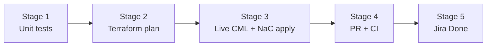

<!--
File Chain (see DEVELOPER.md):
Doc Version: v1.0.0
Date Modified: 2026-06-08

Purpose: TG-162 closeout pipeline — offline gates + live CML/NaC terraform apply.
Blast Radius: Documentation and validation script only.
-->

# TG-162 closeout pipeline

**Story:** Expand DMVPN NaC projection for nac-iosxe tunnel/crypto (TG-162)  
**Branch:** `story/TG-162-dmvpn-nac-fidelity`  
**Rule:** Do **not** move TG-162 to **Done** until Stage 3 live validation passes (if your team requires live proof for NaC stories).

## Pipeline overview



| Stage | Gate | Owner | Automated |
|-------|------|-------|-----------|
| 1 | `tests/test_nac_writer.py -k dmvpn` | Dev / CI | Yes |
| 2 | `tests/test_nac_terraform_plan.py -m terraform` (9-case matrix) | Dev / CI | Yes (`TOPOGEN_TERRAFORM_PLAN=1`) |
| 3 | CML2 `apply` → mgmt DHCP sync → NaC `apply` → CLI checks | Dev / test agent | Partial (`validate-tg162-dmvpn-live.ps1 -LiveApply`) |
| 4 | PR merged; GitHub Actions green | Orchestrator | Partial |
| 5 | TG-162 → Done; CHANGES.md unreleased entry | Orchestrator | No |

Run offline gates (1–2):

```powershell
.\scripts\validate-tg162-dmvpn-live.ps1
```

Artifact root for live validation: `out/TG162-LIVE-DMVPN-N3/` (regenerate with `-Regenerate`).

---

## Stage 1 — Unit tests

**Pass criteria:** all DMVPN NaC writer tests pass.

```powershell
Set-Location "<repo-root>"
python -m pytest tests/test_nac_writer.py -k dmvpn -q
```

**Covers:** `tunnel_source`, `ipv4.redirects: false`, IKEv2-PSK crypto projection, pair-VRF attrs.

---

## Stage 2 — Terraform plan contract

**Pass criteria:** 9 matrix cases plan cleanly; DMVPN rows match `plan_must_match` snippets.

```powershell
$env:TOPOGEN_TERRAFORM_PLAN = "1"
python -m pytest tests/test_nac_terraform_plan.py -m terraform -q
Remove-Item Env:TOPOGEN_TERRAFORM_PLAN -ErrorAction SilentlyContinue
```

No live devices; `terraform apply` is **not** run here.

---

## Stage 3 — Live CML + full Terraform (required before Done)

**Pass criteria:** CML lab **STARTED** with all routers **BOOTED**; NaC `terraform apply` succeeds; tunnel/crypto attrs present on devices.

### Preconditions

- CML 2.x reachable from your workstation (corp VPN if using `wwwin` CML)
- IOSv image available on the controller
- Terraform ≥ 1.5, Python env with `topogen` deps
- **Mgmt bridge required** for workstation → router RESTCONF (`--mgmt --mgmt-bridge`). NaC `host` values are empty until DHCP sync — do not apply NaC before sync.
- Credentials via environment only (never commit):

```powershell
$env:TF_VAR_address   = "https://<cml-controller>/"
$env:TF_VAR_username  = "<cml-user>"
$env:TF_VAR_password  = "<cml-password>"
$env:TF_VAR_skip_verify = "true"   # self-signed lab controllers only

$env:IOSXE_USERNAME   = "cisco"
$env:IOSXE_PASSWORD   = "cisco"
# Optional single-device fallback; multi-device uses per-device host in nac.yaml after sync
$env:IOSXE_URL        = "https://192.168.1.x"
```

Matching `VIRL2_URL` / `VIRL2_USER` / `VIRL2_PASS` for `scripts/sync-nac-mgmt-dhcp.py`.

### Generate lab bundle (once)

**Important:** Live NaC `terraform apply` requires **IOS-XE** (NETCONF on port 830). **IOSv is classic IOS** — `restconf` / `netconf-yang` are rejected at boot; use IOSv for offline/plan matrix only. For live apply, use **CSR1000v** (or IOL XE if available).

**CSR live apply (recommended):**

```powershell
python -m topogen 3 --mode dmvpn --dmvpn-hubs 1 `
  -T csr-dmvpn --device-template csr1000v `
  -L "TG162-LIVE-DMVPN-CSR-N3" `
  --offline-yaml out/TG162-LIVE-DMVPN-CSR-N3.yaml `
  --nac --terraform-cml2 --mgmt --mgmt-bridge --overwrite
```

**IOSv plan-only / topology smoke (NaC apply will fail on NETCONF):**

```powershell
python -m topogen 3 --mode dmvpn --dmvpn-hubs 1 `
  -T iosv-dmvpn --device-template iosv `
  -L "TG162-LIVE-DMVPN-N3" `
  --offline-yaml out/TG162-LIVE-DMVPN-N3.yaml `
  --nac --terraform-cml2 --mgmt --mgmt-bridge --overwrite
```

Output layout:

```
out/TG162-LIVE-DMVPN-N3/
  TG162-LIVE-DMVPN-N3.yaml    # CML topology
  cml2/                       # Phase 1 — import + start lab
  nac/                        # Phase 2 — nac-iosxe apply
```

**Optional IKEv2-PSK variant** (adds crypto resources under test):

```powershell
python -m topogen 3 --mode dmvpn --dmvpn-hubs 1 `
  -T iosv-dmvpn --device-template iosv `
  --dmvpn-security ikev2-psk --dmvpn-psk "<secret-from-env>" `
  -L "TG162-LIVE-DMVPN-PSK-N3" `
  --offline-yaml out/TG162-LIVE-DMVPN-PSK-N3.yaml `
  --nac --terraform-cml2 --mgmt --mgmt-bridge --overwrite
```

### Phase 1 — CML2 Terraform apply

```powershell
$lab = "out/TG162-LIVE-DMVPN-N3"
terraform -chdir="$lab/cml2" init
terraform -chdir="$lab/cml2" apply -auto-approve -var="wait=true"
$labId = terraform -chdir="$lab/cml2" output -raw lab_id
```

Wait until all three IOSv routers (R1–R3) are **BOOTED** (provider `wait=true` blocks until boot completes when supported).

### Phase 2 — Sync mgmt DHCP → NaC hosts

NaC scaffold omits fabricated OOB addresses when `--mgmt-bridge` is set. Patch `nac.yaml` / `inventory.yaml` from live Gi5 DHCP:

```powershell
python scripts/sync-nac-mgmt-dhcp.py `
  --lab-id $labId `
  --nac-root "$lab/nac" `
  --fix-dhcp
```

Expect `192.168.1.x` hosts for `iosv-01` … `iosv-03`. Report: `nac/mgmt_dhcp_sync.json`.

### Phase 3 — NaC Terraform apply

```powershell
terraform -chdir="$lab/nac" init
terraform -chdir="$lab/nac" plan
terraform -chdir="$lab/nac" apply -auto-approve
```

### Phase 4 — Device verification (TG-162 scope)

On **R1** (hub) via CML console or MCP `send_cli_command`:

```
show run interface Tunnel0 | include tunnel source
show run interface Tunnel0 | include redirects
show ip nhrp summary
show ip eigrp neighbors
```

**Expect (NaC-owned after apply):**

- `tunnel source GigabitEthernet0/0` (IOSv NBMA interface)
- `no ip redirects` on Tunnel0

**Expect (day-0 only, not NaC):**

- NHRP (`ip nhrp …`), EIGRP under tunnel, mGRE mode — still from CML day-0 bootstrap

For **PSK lab**, also verify:

```
show crypto ikev2 proposal
show crypto ipsec transform-set
show run interface Tunnel0 | include tunnel protection
```

### Teardown

```powershell
terraform -chdir="$lab/nac" destroy -auto-approve
terraform -chdir="$lab/cml2" destroy -auto-approve
```

### One-shot orchestration

When CML/IOS-XE env vars are set:

```powershell
.\scripts\validate-tg162-dmvpn-live.ps1 -LiveApply
```

### Fail / block

- NaC apply before mgmt DHCP sync (empty or wrong `host` → RESTCONF unreachable)
- Applying without `--mgmt-bridge` from outside the lab (NBMA `10.10.0.x` not routed to workstation)
- Terraform crypto schema drift vs pinned `netascode/nac-iosxe` 0.1.0 (catch in Stage 2 first)

### Evidence (attach to Jira or PR)

```
out/TG162-LIVE-DMVPN-N3/live/
  cml2-apply.log
  nac-plan.log
  nac-apply.log
  mgmt_dhcp_sync.json
  r1-tunnel0-show-run.txt
```

---

## Stage 4 — PR and CI

**Pass criteria:** branch on **cisco** remote; PR review; CI green.

---

## Stage 5 — Closeout

- [x] Stages 1–3 green (offline gates + live `DMVPN-N4-H1-CSR` NaC apply, 16/16 resources)
- [x] `CHANGES.md` TG-162 entry
- [ ] Jira TG-162 → **Done** (after PR merge)
