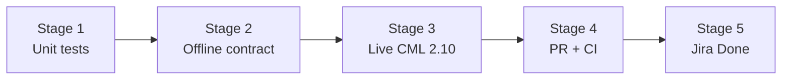

<!--
File Chain (see DEVELOPER.md):
Doc Version: v1.0.0
Date Modified: 2026-06-06

Purpose: TG-165 closeout pipeline — CI/CD-style gates before Jira Done.
Blast Radius: Documentation and validation script only.
-->

# TG-165 closeout pipeline

**Story:** Auto-emit node staging when `--pki` is enabled  
**Epic:** TG-147  
**Branch:** `feature/TG-165-pki-auto-staging`  
**Rule:** Do **not** move TG-165 to **Done** until every gate below is green.

Staging is emitted in offline YAML **only** when `--cml-version 0.3.1` (CML 2.10). Default `0.3.0` logs a warning and omits `node_staging`.

## Pipeline overview



| Stage | Gate | Owner | Automated |
|-------|------|-------|-----------|
| 1 | `tests/test_staging_pki.py` — 8/8 pass | Dev / CI | Yes |
| 2 | Offline YAML contract (generate + grep) | Dev / CI | Yes |
| 3 | CML 2.10 import, staging enabled, CA-ROOT boots first | Test agent ([TG-166](https://roberthosford.atlassian.net/browse/TG-166)) | Manual / MCP |
| 4 | PR merged to epic on **cisco**; GitHub Actions green | Orchestrator | Partial |
| 5 | TG-165 → Done; CHANGES.md unreleased entry | Orchestrator | No |

Run offline gates (1–2):

```powershell
.\scripts\validate-tg165.ps1
```

Artifact root for live validation: `C:\tfval\tg165_pki_staging\`

---

## Stage 1 — Unit tests

**Pass criteria:** `8 passed`, `0 failed`

```powershell
Set-Location "<repo-root>"
python -m pytest tests/test_staging_pki.py -q
```

**Covers:**

- `--pki` + `--cml-version 0.3.1` → `args.staging == True`
- `--no-staging` opt-out
- Non-PKI does not auto-enable
- `--cml-version 0.3.0` disables staging (guardrail)
- Offline YAML contains `node_staging` + CA-ROOT `priority: 900`

---

## Stage 2 — Offline YAML contract

**Pass criteria:** Script exits `0`; all assertions in `validate-tg165.ps1` pass.

Generate three labs under `C:\tfval\tg165_pki_staging\offline\`:

| Case | Flags | Expect |
|------|-------|--------|
| A — auto staging | `--pki --cml-version 0.3.1` | `node_staging:`, `enabled: true`, `label: CA-ROOT`, `priority: 900` |
| B — opt out | `--pki --no-staging --cml-version 0.3.1` | No `node_staging:` block |
| C — old schema | `--pki --cml-version 0.3.0` | No `node_staging:` block (warn only) |

Example (case A):

```powershell
python -m topogen 3 -m dmvpn --dmvpn-hubs 1 --device-template csr1000v `
  --pki --cml-version 0.3.1 --offline-yaml C:\tfval\tg165_pki_staging\offline\pki-staged.yaml --overwrite
```

---

## Stage 3 — Live CML 2.10 (required before Done)

**Pass criteria:** All checkboxes checked by test agent; evidence paths recorded in Jira.

**Preconditions:**

- CML **2.10** (schema `0.3.1`) reachable
- CSR1000v image available
- Use case A YAML from Stage 2 (or regenerate with same flags)

**Steps:**

1. **Import** lab YAML into CML (UI or `--import` / `--up` if credentials configured).
2. **Verify lab-level staging** — after import, "Node Staging" enabled (TopoGen `--up` sets this via API; manual UI import requires enabling in lab settings).
3. **Verify per-node priority** — CA-ROOT priority **900**; ext-connector / data switch higher if present.
4. **Start lab** with staging on — CA-ROOT reaches `BOOTED` / config applied before enrolling routers attempt SCEP.
5. **Optional smoke** — on one spoke, confirm PKI trustpoint enrollment succeeds without manual CA power-on.

**Fail / block:**

- All nodes boot simultaneously with `--pki --cml-version 0.3.1` and staging enabled in YAML
- CA-ROOT not priority 900
- Enrollment fails due to CA not ready (boot-order race)

**Evidence (attach to Jira or PR):**

```
C:\tfval\tg165_pki_staging\live\
  import-log.txt
  ca-root-boot-time.txt
  staging-settings-screenshot-or-api-dump.txt
```

---

## Stage 4 — PR and CI

**Pass criteria:**

- Branch pushed to **cisco** remote only (`wwwin-github.cisco.com/rohosfor/topogen`)
- PR into `epic/TG-147-universal-nac-dmvpn`
- GitHub Actions **Python package** job green (mypy + ruff on push)
- Review approved; squash-merge when epic owner accepts

**Not required for Stage 3** — can run live CML on local branch before push.

---

## Stage 5 — Closeout

**Pass criteria:**

- [ ] Stages 1–4 green
- [ ] Stage 3 evidence linked in TG-165
- [ ] `CHANGES.md` Unreleased entry for TG-165
- [ ] Jira TG-165 → **Done**
- [ ] `TODO.md` — move TG-165 item to Done if listed

---

## Jira status mapping

| Jira status | Pipeline state |
|-------------|----------------|
| In Progress | Stages 1–2 may pass; Stage 3 not started or in flight |
| In Review | PR open (Stage 4); Stage 3 must be green before merge |
| Done | All stages green; merged |

**Do not set Done until Stage 3 live CML validation passes.**
